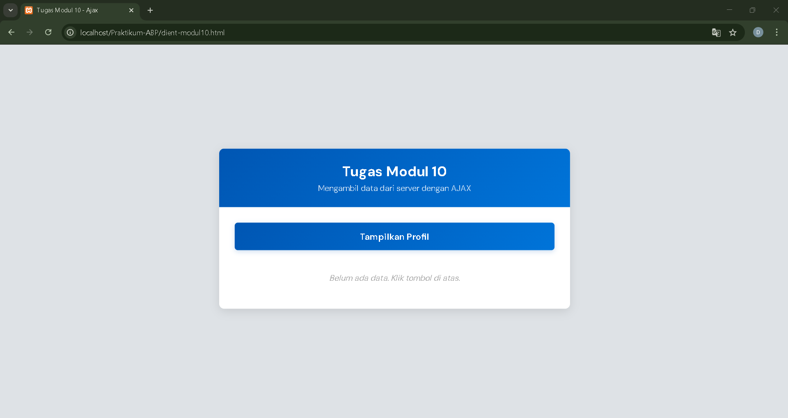
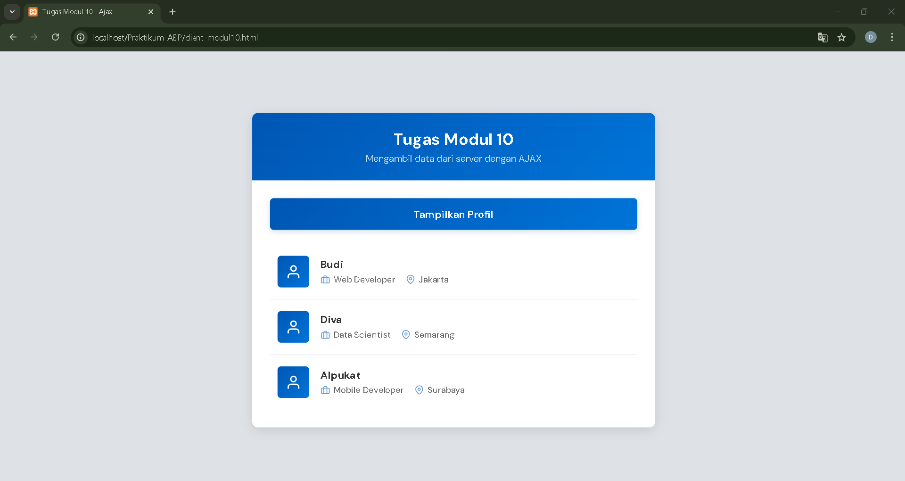
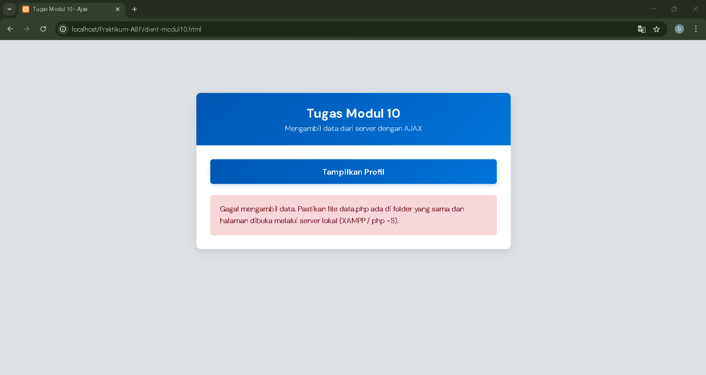

<div align="center">

## LAPORAN PRAKTIKUM <br> APLIKASI BERBASIS PLATFORM

<br>

### MODUL 10
### AJAX

<br>
<br>


<br>
<br>
<br>

**Disusun oleh:**

**Diva Octaviani**  
**2311102006**  

<br>

**KELAS PS1IF-11-REG01**

**Dosen: Dimas Fanny Hebrasianto Permadi, S.ST., M.Kom**

<br><br>

## PROGRAM STUDI S1 TEKNIK INFORMATIKA <br> FAKULTAS INFORMATIKA <br> UNIVERSITAS TELKOM PURWOKERTO <br> 2026 <br><br>

</div>

---

## 1. Dasar Teori

### Pengertian AJAX
AJAX (*Asynchronous JavaScript and XML*) adalah teknik pengembangan web yang memungkinkan aplikasi web untuk mengirim dan menerima data dari *server* tanpa harus *me-refresh* (*reload*) seluruh halaman. Meskipun namanya mengandung XML, AJAX sekarang lebih sering menggunakan format JSON (*JavaScript Object Notation*) karena lebih ringan dan mudah *di-parse* oleh JavaScript. Dengan AJAX, pengalaman pengguna menjadi lebih *smooth* dan *responsive* karena hanya bagian tertentu dari halaman yang diperbarui. 

### Cara Kerja AJAX
Proses AJAX bekerja secara *asynchronous* (tidak sinkron), artinya JavaScript dapat melanjutkan eksekusi kode lain sambil menunggu respons dari *server*. Alur kerjanya adalah:

- `Trigger Event`: *User* melakukan aksi (misal: klik tombol)
Create 
- `XMLHttpRequest/Fetch`: Browser membuat objek untuk mengirim *request*
- `Send Request`: *Request* dikirim ke *server* (GET/POST)
- `*Server* Process`: *Server* memproses *request* dan mengembalikan data (biasanya JSON)
- `Response Handling`: JavaScript menerima *response* dan memperbarui DOM

### Fetch API
*Fetch API* adalah *interface* modern JavaScript untuk melakukan *request* HTTP yang menggantikan *XMLHttpRequest*. *Fetch* menggunakan *Promise* sehingga kode lebih bersih dan mudah dibaca. Sintaks dasarnya adalah `fetch(url)` yang mengembalikan *Promise* yang *resolve* ke *Response object*. Untuk mendapatkan data JSON, digunakan *method* `.json()` pada *response*. *Fetch* juga mendukung `async/await` yang membuat kode *asynchronous* terlihat seperti *synchronous*.

### JSON (JavaScript Object Notation)
JSON adalah format pertukaran data yang ringan dan mudah dibaca manusia. Formatnya menggunakan pasangan *key-value* dalam kurung kurawal `{}` untuk objek dan kurung siku `[]` untuk *array*. Dalam konteks PHP, fungsi `json_encode()` digunakan untuk mengubah *array* PHP menjadi string JSON, sedangkan di JavaScript, `response.json()` digunakan untuk *parsing* JSON menjadi objek JavaScript. Keuntungan JSON adalah ukurannya kecil dan bisa langsung diproses oleh JavaScript tanpa *parsing* tambahan.

### Client-*Server* Architecture
Dalam implementasi AJAX, terdapat dua komponen utama:
- **Server* Side* (PHP): Bertanggung jawab menyediakan data, biasanya dari database atau *array*, kemudian mengubahnya menjadi format JSON dengan *header* `Content-Type: application/json`.
- *Client Side* (HTML/JavaScript): Bertanggung jawab meminta data ke *server* menggunakan *fetch*, kemudian memanipulasi DOM untuk menampilkan data tanpa *reload* halaman.

### DOM Manipulation
DOM (*Document Object Model*) adalah representasi struktural halaman HTML yang dapat dimanipulasi oleh JavaScript. Dalam AJAX, setelah data diterima dari *server*, JavaScript menggunakan *method* seperti `document.getElementById()`, `innerHTML`, `createElement()`, dan `appendChild()` untuk menyisipkan atau memperbarui elemen HTML secara dinamis sesuai data yang diterima.

---

## 2. Hasil Praktikum

### a. Source Code

Pada Tugas Modul 10 ini, dikembangkan aplikasi Tampilan Profil dengan AJAX yang menerapkan konsep *Fetch API* untuk mengambil data dari *server* secara *asynchronous*, JSON sebagai format pertukaran data antara PHP dan JavaScript, *DOM Manipulation* untuk menampilkan data dinamis ke halaman, *Event Handling* untuk merespons klik tombol, serta *Error Handling* dengan *try-catch* untuk menangani kesalahan jaringan atau *server*.

Aplikasi terdiri dari 2 file:

1. `server-modul10.php` → File *server* yang menyediakan data dalam format JSON
2. `client-modul10.html` → File *client* yang menampilkan UI dan mengambil data via AJAX

---

### `server-modul10.php`

```php
<?php

// Set header agar browser tahu ini adalah data JSON
header('Content-Type: application/json');

// Data sederhana (simulasi database)
 $data = [
    ['nama' => 'Budi', 'pekerjaan' => 'Web Developer', 'lokasi' => 'Jakarta'],
    ['nama' => 'Diva', 'pekerjaan' => 'Data Scientist', 'lokasi' => 'Semarang'],
    ['nama' => 'Alpukat', 'pekerjaan' => 'Mobile Developer', 'lokasi' => 'Surabaya']
];

// Ubah array menjadi JSON dan tampilkan
echo json_encode($data);
```

Bagian penting dari kode tersebut meliputi:
- `header('Content-Type: application/json')`: Memberitahu browser bahwa *response* berupa data JSON, bukan HTML.
- Array `$data`: Menyimpan 3 data profil (nama, pekerjaan, lokasi) sebagai simulasi *database*.
- `json_encode($data)`: Mengubah *array* PHP menjadi format JSON *string*.
- `echo`: Mengirim hasil JSON ke *client*.


### `client-modul10.php`

```html
<!DOCTYPE html>
<html lang="id">

<head>
    <meta charset="UTF-8">
    <meta name="viewport" content="width=device-width, initial-scale=1.0">
    <title>Tugas Modul 10 - Ajax</title>
    <link href="https://fonts.googleapis.com/css2?family=DM+Sans:wght@400;500;600;700&display=swap" rel="stylesheet">
    <style>
        :root {
            --blue-deep: #0056b3;
            --blue-mid: #0074d9;
            --blue-light: #f1f8ff;
            --blue-border: #dee2e6;
            --blue-stat: #f8f9fa;
            --text-dark: #333;
            --text-muted: #666;
        }

        * {
            margin: 0;
            padding: 0;
            box-sizing: border-box;
        }

        body {
            font-family: 'DM Sans', sans-serif;
            background-color: var(--blue-border);
            margin: 0;
            padding: 20px;
            color: var(--text-dark);
            min-height: 100vh;
            display: flex;
            align-items: center;
            justify-content: center;
        }

        .container {
            max-width: 560px;
            width: 100%;
            background: #ffffff;
            border-radius: 8px;
            box-shadow: 0 4px 15px rgba(0, 0, 0, 0.1);
            overflow: hidden;
        }

        .header {
            background: linear-gradient(135deg, var(--blue-deep), var(--blue-mid));
            color: white;
            padding: 22px;
            text-align: center;
        }

        .header h1 {
            margin: 0;
            font-family: 'DM Sans', sans-serif;
            font-size: 22px;
            font-weight: 700;
        }

        .header p {
            margin: 4px 0 0;
            font-size: 13px;
            opacity: 0.75;
        }

        .content {
            padding: 25px;
        }

        .btn {
            display: block;
            width: 100%;
            padding: 13px;
            background: linear-gradient(135deg, var(--blue-deep), var(--blue-mid));
            color: #fff;
            font-family: 'DM Sans', sans-serif;
            font-size: 14px;
            font-weight: 600;
            border: none;
            border-radius: 5px;
            cursor: pointer;
            transition: opacity 0.2s, transform 0.15s;
            box-shadow: 0 2px 8px rgba(0, 86, 179, 0.2);
            position: relative;
        }

        .btn:hover {
            opacity: 0.9;
            transform: translateY(-1px);
        }

        .btn:active {
            transform: translateY(0);
        }

        .btn.loading {
            pointer-events: none;
            opacity: 0.65;
        }

        .btn .btn-text {
            transition: opacity 0.15s;
        }

        .btn.loading .btn-text {
            opacity: 0;
        }

        .btn .spinner {
            display: none;
            width: 18px;
            height: 18px;
            border: 2.5px solid rgba(255, 255, 255, 0.3);
            border-top-color: #fff;
            border-radius: 50%;
            animation: spin 0.6s linear infinite;
            position: absolute;
            top: 50%;
            left: 50%;
            transform: translate(-50%, -50%);
        }

        .btn.loading .spinner {
            display: block;
        }

        @keyframes spin {
            to {
                transform: translate(-50%, -50%) rotate(360deg);
            }
        }

        #hasil-profil {
            margin-top: 20px;
        }

        .placeholder {
            color: #aaa;
            font-size: 13px;
            font-style: italic;
            text-align: center;
            padding: 16px 0;
        }

        .profil-item {
            display: flex;
            align-items: center;
            gap: 16px;
            border-bottom: 1px solid #eee;
            padding: 16px 10px;
            opacity: 0;
            transform: translateY(8px);
            animation: fadeUp 0.35s ease-out forwards;
            transition: background 0.15s;
        }

        .profil-item:last-child {
            border-bottom: none;
        }

        .profil-item:nth-child(1) {
            animation-delay: 0.05s;
        }

        .profil-item:nth-child(2) {
            animation-delay: 0.12s;
        }

        .profil-item:nth-child(3) {
            animation-delay: 0.19s;
        }

        .profil-item:hover {
            background-color: var(--blue-light);
        }

        @keyframes fadeUp {
            to {
                opacity: 1;
                transform: translateY(0);
            }
        }

        .avatar {
            width: 44px;
            height: 44px;
            border-radius: 5px;
            background: linear-gradient(135deg, var(--blue-deep), var(--blue-mid));
            display: flex;
            align-items: center;
            justify-content: center;
            flex-shrink: 0;
        }

        .avatar svg {
            width: 22px;
            height: 22px;
            color: #fff;
        }

        .profil-info {
            flex: 1;
            min-width: 0;
        }

        .profil-nama {
            font-weight: 700;
            font-size: 14px;
            color: var(--text-dark);
            margin-bottom: 4px;
        }

        .profil-meta {
            display: flex;
            flex-wrap: wrap;
            gap: 14px;
        }

        .meta-item {
            display: flex;
            align-items: center;
            gap: 5px;
            font-size: 12px;
            color: var(--text-muted);
        }

        .meta-item svg {
            width: 13px;
            height: 13px;
            color: var(--blue-deep);
            flex-shrink: 0;
            opacity: 0.6;
        }

        .error-msg {
            color: #721c24;
            font-size: 13px;
            line-height: 1.6;
            padding: 14px 16px;
            border-radius: 5px;
            background: #f8d7da;
            border: 1px solid #f5c6cb;
        }

        @media (max-width: 480px) {
            body {
                padding: 12px;
            }

            .content {
                padding: 18px;
            }

            .header {
                padding: 18px;
            }

            .header h1 {
                font-size: 18px;
            }

            .profil-meta {
                gap: 10px;
            }
        }

        @media (prefers-reduced-motion: reduce) {

            *,
            *::before,
            *::after {
                animation-duration: 0.01ms !important;
                transition-duration: 0.01ms !important;
            }
        }
    </style>
</head>

<body>

    <svg xmlns="http://www.w3.org/2000/svg" style="display:none">
        <symbol id="icon-user" viewBox="0 0 24 24" fill="none" stroke="currentColor" stroke-width="2"
            stroke-linecap="round" stroke-linejoin="round">
            <path d="M20 21v-2a4 4 0 0 0-4-4H8a4 4 0 0 0-4 4v2" />
            <circle cx="12" cy="7" r="4" />
        </symbol>
        <symbol id="icon-briefcase" viewBox="0 0 24 24" fill="none" stroke="currentColor" stroke-width="2"
            stroke-linecap="round" stroke-linejoin="round">
            <rect x="2" y="7" width="20" height="14" rx="2" ry="2" />
            <path d="M16 21V5a2 2 0 0 0-2-2h-4a2 2 0 0 0-2 2v16" />
        </symbol>
        <symbol id="icon-map-pin" viewBox="0 0 24 24" fill="none" stroke="currentColor" stroke-width="2"
            stroke-linecap="round" stroke-linejoin="round">
            <path d="M21 10c0 7-9 13-9 13s-9-6-9-13a9 9 0 0 1 18 0z" />
            <circle cx="12" cy="10" r="3" />
        </symbol>
    </svg>

    <div class="container">
        <div class="header">
            <h1>Tugas Modul 10</h1>
            <p>Mengambil data dari server dengan AJAX</p>
        </div>

        <div class="content">
            <button class="btn" id="btnTampilkan" type="button">
                <span class="btn-text">Tampilkan Profil</span>
                <span class="spinner"></span>
            </button>

            <div id="hasil-profil">
                <p class="placeholder">Belum ada data. Klik tombol di atas.</p>
            </div>
        </div>
    </div>

    <script>
        const btn = document.getElementById('btnTampilkan');
        const hasil = document.getElementById('hasil-profil');

        btn.addEventListener('click', async function () {
            this.classList.add('loading');

            try {
                const response = await fetch('server-modul10.php');

                if (!response.ok) {
                    throw new Error('Server error: ' + response.status);
                }

                const data = await response.json();
                hasil.innerHTML = '';

                data.forEach(item => {
                    const div = document.createElement('div');
                    div.className = 'profil-item';

                    div.innerHTML = `
                        <div class="avatar">
                            <svg><use href="#icon-user"/></svg>
                        </div>
                        <div class="profil-info">
                            <div class="profil-nama">${item.nama}</div>
                            <div class="profil-meta">
                                <span class="meta-item">
                                    <svg><use href="#icon-briefcase"/></svg>
                                    ${item.pekerjaan}
                                </span>
                                <span class="meta-item">
                                    <svg><use href="#icon-map-pin"/></svg>
                                    ${item.lokasi}
                                </span>
                            </div>
                        </div>
                    `;

                    hasil.appendChild(div);
                });

            } catch (error) {
                hasil.innerHTML = `
                    <div class="error-msg">
                        Gagal mengambil data. Pastikan file data.php ada di folder yang sama
                        dan halaman dibuka melalui server lokal (XAMPP / php -S).
                    </div>
                `;
            } finally {
                this.classList.remove('loading');
            }
        });
    </script>
</body>

</html>
```

Bagian penting dari kode tersebut meliputi:
- *Server* (`server-modul10.php`): Menyediakan data *array* dalam format JSON menggunakan `json_encode()` dengan *header* `Content-Type: application/json`.
- *Event Click*: Tombol "Tampilkan Profil" memicu fungsi `async` untuk menjalankan AJAX.
- *Fetch API*: `fetch('server-modul10.php')` mengirim *request* GET ke *server* secara *asynchronous* (tanpa *reload*).
- *Loading State*: Class `.loading` menampilkan *spinner* dan menonaktifkan tombol sambil menunggu *response*.
- *JSON Parse*: `response.json()` mengubah *string* JSON dari *server* menjadi objek JavaScript.
- *DOM Manipulatio*n: `forEach` *loop* membuat elemen `<div>` dinamis untuk setiap profil, lalu `appendChild()` menambahkannya ke `#hasil-profil`.
- *Error Handling*: `try-catch-finally` menangani *error* (koneksi gagal/file tidak ditemukan) dan selalu menghapus *state loading* di `finally`.

---

### b. Screenshot Output

Langkah Menjalankan Program:

- Buka XAMPP, klik *Start* pada *service* Apache hingga berwarna hijau.
- Letakkan file `.php` di dalam folder `C:\xampp\htdocs\Praktikum-ABP` (sesuaikan nama folder).
- Buka browser, ketik `localhost/Praktikum-ABP/client-modul10.html` pada address bar, lalu Enter.

Berikut adalah tampilan output dari Tugas Modul 10.

**Tampilan Awal (Sebelum Klik Tombol):**



Halaman menampilkan judul "Tugas Modul 10", deskripsi "Mengambil data dari server dengan AJAX", tombol biru "Tampilkan Profil", dan teks placeholder "Belum ada data. Klik tombol di atas."

**Tampilan Setelah Klik Tombol (Data Berhasil Dimuat):**



Setelah tombol diklik, halaman tidak *reload* sama sekali. Data diambil dari server via AJAX dan ditampilkan dalam bentuk 3 kartu profil dengan animasi *fade-up* bertahap.

**Tampilan Error (Jika Server Tidak Ditemukan):**



Jika file `server-modul10.php` tidak ditemukan atau server error, ditampilkan pesan error berwarna merah dengan penjelasan solusi: "Gagal mengambil data. Pastikan file data.php ada di folder yang sama dan halaman dibuka melalui server lokal."

---