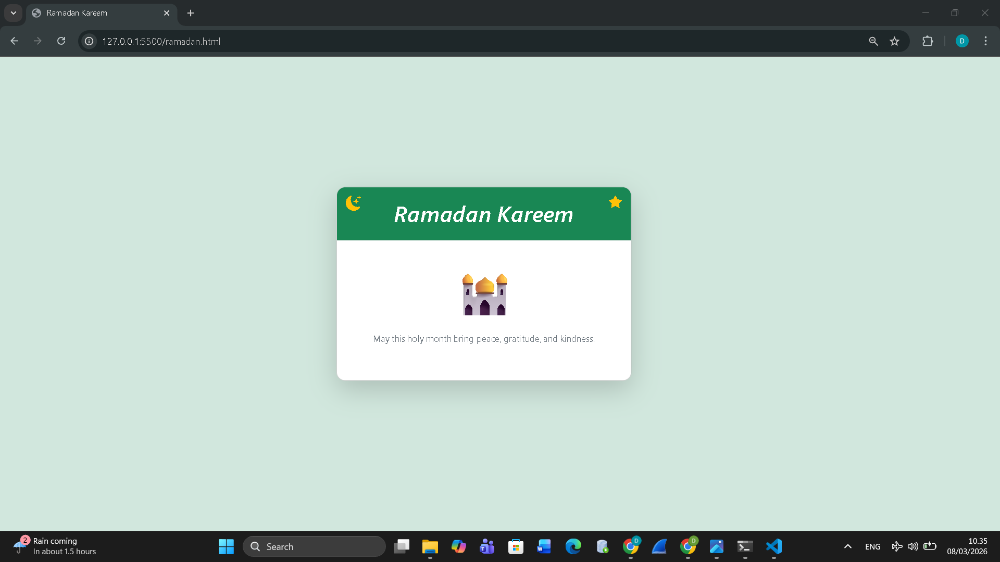

<div align="center">

## LAPORAN PRAKTIKUM <br> APLIKASI BERBASIS PLATFORM
  
<br>

### MODUL 4
### BOOTSTRAP

<br>
<br>


<br>
<br>
<br>

**Disusun oleh:**

**Diva Octaviani**  
**2311102006**  

<br>

**KELAS PS1IF-11-REG01**

**Dosen: Dimas Fanny Hebrasianto Permadi, S.ST., M.Kom**

<br><br>

## PROGRAM STUDI S1 TEKNIK INFORMATIKA <br> FAKULTAS INFORMATIKA <br> UNIVERSITAS TELKOM PURWOKERTO <br> 2026 <br><br>

</div>

---

## 1. Dasar Teori

Bootstrap merupakan *framework* CSS yang digunakan untuk mempermudah proses pembuatan tampilan website agar lebih rapi, responsif, dan menarik tanpa harus menulis banyak kode CSS secara manual. Bootstrap menyediakan berbagai komponen siap pakai seperti *grid system*, *card*, tombol, ikon, dan berbagai *class utility* yang dapat langsung digunakan pada elemen HTML.

Dengan menggunakan Bootstrap, kita dapat membuat tampilan halaman web yang konsisten dan dapat menyesuaikan ukuran layar perangkat, baik pada komputer maupun perangkat mobile. Pada praktikum ini, Bootstrap digunakan untuk membuat halaman bertema Ramadan tanpa CSS tambahan.

---

## 2. Hasil Praktikum

### **a. Source Code**

Berikut merupakan source code `ramadan.html` yang menggunakan Bootstrap.

```html
<!DOCTYPE html>
<html lang="en">

<head>
    <meta charset="UTF-8">
    <meta name="viewport" content="width=device-width, initial-scale=1.0">
    <title>Ramadan Kareem</title>

    <link href="https://cdn.jsdelivr.net/npm/bootstrap@5.3.0/dist/css/bootstrap.min.css" rel="stylesheet">

    <link rel="stylesheet" href="https://cdn.jsdelivr.net/npm/bootstrap-icons@1.10.5/font/bootstrap-icons.css">

</head>

<body class="bg-success-subtle min-vh-100">

    <div class="container min-vh-100 d-flex align-items-center justify-content-center">

        <div class="card shadow-lg rounded-4 overflow-hidden text-center col-lg-5 col-md-7">

            <div class="card-header bg-success text-white position-relative p-4">

                <i class="bi bi-moon-stars-fill text-warning position-absolute top-0 start-0 mt-2 ms-3 fs-3"></i>

                <i class="bi bi-star-fill text-warning position-absolute top-0 end-0 mt-2 me-3 fs-4"></i>

                <h1 class="display-6 fst-italic fw-semibold m-0">
                    Ramadan Kareem
                </h1>

            </div>

            <div class="card-body p-5">

                <div class="display-1 mb-4">
                    🕌
                </div>

                <p class="text-secondary">
                    May this holy month bring peace, gratitude, and kindness.
                </p>

            </div>

        </div>

    </div>

    <script src="https://cdn.jsdelivr.net/npm/bootstrap@5.3.0/dist/js/bootstrap.bundle.min.js"></script>

</body>

</html>
```

Source code halaman *Ramadan Kareem* menggunakan Bootstrap sepenuhnya tanpa CSS tambahan. Layout dibuat responsif dengan `container`, `d-flex`, `align-items-center`, dan `justify-content-center`. Konten utama menggunakan `card` dengan `shadow-lg` dan `rounded-4`, serta ikon bulan dan bintang di header menggunakan Bootstrap Icons. Emoji dan teks ditampilkan di `card-body` untuk pesan Ramadan yang sederhana dan menarik.

### **b. Screenshot Output**

Berikut merupakan tampilan output yang dihasilkan dari source code tersebut.



Tampilan halaman menunjukkan latar belakang *soft green*, kartu putih di tengah layar, judul “Ramadan Kareem” di atas, ikon bulan dan bintang di sudut header, serta emoji masjid dan teks ucapan Ramadan di bagian tengah. Semua elemen tersusun rapi dan responsif sesuai ukuran layar karena menggunakan Bootstrap.

