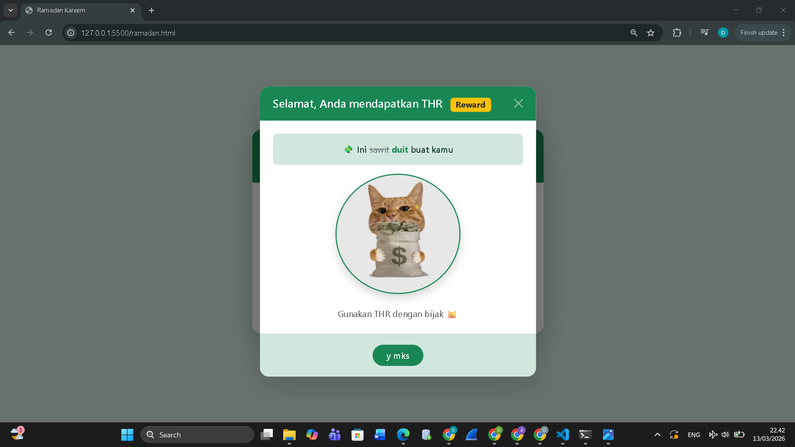

<div align="center">

## LAPORAN PRAKTIKUM <br> APLIKASI BERBASIS PLATFORM
  
<br>

### MODUL 5
### JAVASCRIPT & JQUERY

<br>
<br>


<br>
<br>
<br>

**Disusun oleh:**

**Diva Octaviani**  
**2311102006**  

<br>

**KELAS PS1IF-11-REG01**

**Dosen: Dimas Fanny Hebrasianto Permadi, S.ST., M.Kom**

<br><br>

## PROGRAM STUDI S1 TEKNIK INFORMATIKA <br> FAKULTAS INFORMATIKA <br> UNIVERSITAS TELKOM PURWOKERTO <br> 2026 <br><br>

</div>

---

## 1. Dasar Teori

JavaScript adalah bahasa pemrograman *scripting* yang berjalan di sisi *client* (browser) dan digunakan untuk membuat halaman HTML menjadi dinamis dan interaktif. JavaScript mendukung tiga paradigma pemrograman, yaitu imperatif (perintah dijalankan baris per baris), fungsional (menggunakan fungsi sebagai unit utama), dan berorientasi objek (setiap elemen diperlakukan sebagai objek).

Beberapa konsep dasar JavaScript yang perlu dipahami antara lain:
- **Tipe data**, meliputi number, string, boolean, array, object, null, dan undefined
- **Variabel**, dideklarasikan menggunakan `var`, `let`, atau `const` sebagai tempat penyimpanan data sementara
- **Fungsi**, digunakan untuk membungkus sekumpulan perintah agar dapat dipanggil berulang kali. Fungsi dapat dibuat dengan *function declaration* maupun *function expression*
- **Pengendalian struktur**, mencakup percabangan (`if/else`) dan perulangan (`for`, `while`, `do-while`) yang penulisannya mirip dengan bahasa C atau Java

jQuery adalah *library* JavaScript yang dibuat oleh John Resig pada tahun 2006. jQuery hadir untuk menyederhanakan penulisan JavaScript, terutama untuk keperluan manipulasi DOM, penanganan *event*, animasi, dan komunikasi AJAX. Dengan jQuery, operasi yang biasanya membutuhkan banyak baris kode JavaScript dapat dilakukan hanya dalam satu atau dua baris. jQuery dapat digunakan dengan dua cara, yaitu mengunduh file-nya secara lokal atau memuatnya langsung melalui CDN (*Content Delivery Network*).

Sintaks dasar jQuery menggunakan tanda `$` sebagai selektor, misalnya `$(document).ready()` untuk menjalankan kode setelah seluruh elemen DOM selesai dimuat, atau `$("#id").click()` untuk menangani event klik pada elemen tertentu.

---

## 2. Hasil Praktikum

### **a. Source Code**

Pada praktikum ini, halaman Ramadan Kareem dari modul sebelumnya dikembangkan dengan interaktivitas menggunakan JavaScript dan jQuery.

```html
<!DOCTYPE html>
<html lang="en">

<head>
    <meta charset="UTF-8">
    <meta name="viewport" content="width=device-width, initial-scale=1.0">
    <title>Ramadan Kareem</title>
    <link href="https://cdn.jsdelivr.net/npm/bootstrap@5.3.0/dist/css/bootstrap.min.css" rel="stylesheet">
    <link rel="stylesheet" href="https://cdn.jsdelivr.net/npm/bootstrap-icons@1.10.5/font/bootstrap-icons.css">
</head>

<body class="bg-success-subtle min-vh-100 d-flex align-items-center justify-content-center">

    <div class="container py-5">
        <div class="row justify-content-center">
            <div class="col-lg-5 col-md-7">

                <div class="card border-0 shadow-lg rounded-4 overflow-hidden text-center">

                    <!-- HEADER -->
                    <div class="card-header bg-success text-white p-4 border-0 position-relative">
                        <i
                            class="bi bi-moon-stars-fill text-warning position-absolute top-0 start-0 mt-3 ms-3 fs-3"></i>
                        <i class="bi bi-star-fill text-warning position-absolute top-0 end-0 mt-3 me-3 fs-5"></i>
                        <h1 class="display-6 fst-italic fw-semibold m-0">Ramadan Kareem</h1>
                    </div>

                    <!-- BODY -->
                    <div class="card-body bg-white px-5 py-4">
                        <div class="display-1 my-3">🕌</div>
                        <p class="text-secondary mb-4 px-2">
                            May this holy month bring peace, gratitude, and kindness.
                        </p>
                        <button id="btnThr" class="btn btn-success btn-lg shadow-sm px-5 rounded-pill fw-semibold">
                            🎁 Klaim THR
                        </button>
                    </div>


                </div>
            </div>
        </div>
    </div>


    <!-- MODAL -->
    <div class="modal fade" id="thrModal" tabindex="-1">
        <div class="modal-dialog modal-dialog-centered">
            <div class="modal-content border-0 shadow-lg rounded-4 overflow-hidden text-center">

                <div class="modal-header bg-success text-white border-0 px-4">
                    <h5 class="modal-title fw-semibold">
                        Selamat, Anda mendapatkan THR
                        <span class="badge bg-warning text-dark ms-2">Reward</span>
                    </h5>
                    <button type="button" class="btn-close btn-close-white" data-bs-dismiss="modal"></button>
                </div>

                <div class="modal-body bg-white p-4">
                    <div class="alert alert-success border-0 rounded-3 fw-semibold">
                        💸 Ini <s class="text-secondary fw-normal">sawit</s>
                        <span class="fw-bold text-success">duit</span> buat kamu
                    </div>
                    
                    <p class="text-muted mt-3 mb-0">Gunakan THR dengan bijak 😺</p>
                </div>

                <div class="modal-footer bg-success-subtle border-0 justify-content-center py-3">
                    <button class="btn btn-success rounded-pill px-4 fw-semibold" data-bs-dismiss="modal">y mks</button>
                </div>

            </div>
        </div>
    </div>


    <script src="https://code.jquery.com/jquery-3.7.1.min.js"></script>
    <script src="https://cdn.jsdelivr.net/npm/bootstrap@5.3.0/dist/js/bootstrap.bundle.min.js"></script>

    <script>
        $(function () {

            // buka modal saat tombol diklik
            $('#btnThr').click(function () {
                let modal = new bootstrap.Modal(document.getElementById('thrModal'));
                modal.show();
            });

            // animasi gambar saat modal terbuka
            $('#thrModal').on('shown.bs.modal', function () {
                $('#kucing').hide().fadeIn(800);
            });

        });
    </script>

</body>

</html>
```
Halaman ini dikembangkan dengan menggunakan JavaScript dan jQuery. Library jQuery dimuat melalui CDN sebelum Bootstrap JS, kemudian digunakan di dalam blok `$(function(){...})` sebagai *entry point* yang memastikan kode berjalan setelah DOM selesai dimuat. Terdapat dua fungsi utama yang diimplementasikan, yaitu `$('#btnThr').click()` untuk membuka modal melalui JavaScript menggunakan `new bootstrap.Modal().show()`, serta event `$('#thrModal').on('shown.bs.modal')` untuk menjalankan animasi `.hide().fadeIn(800)` pada gambar kucing setiap kali modal selesai ditampilkan.


### **b. Screenshot Output**

Berikut merupakan tampilan output yang dihasilkan dari source code tersebut.




Hasil output pertama menunjukkan tampilan awal halaman sebelum tombol diklik. Halaman menampilkan kartu di tengah layar dengan latar belakang hijau muda. Kartu terdiri dari *header* berwarna hijau bertuliskan "Ramadan Kareem" dengan dua ikon dekoratif di sudut kanan dan kiri, diikuti *body* yang berisi emoji masjid, teks "May this holy month bring peace, gratitude, and kindness.", serta tombol "Klaim THR".

Hasil output kedua menunjukkan tampilan setelah tombol "Klaim THR" diklik. Modal muncul di tengah layar dengan *header* hijau bertuliskan "Selamat, Anda mendapatkan THR" dan *badge* "Reward". Di dalam *body* modal terdapat pesan THR, gambar kucing yang muncul secara perlahan menggunakan animasi *fade in* dari jQuery, serta teks penutup. Di bagian bawah modal terdapat tombol "y mks" untuk menutup modal.

