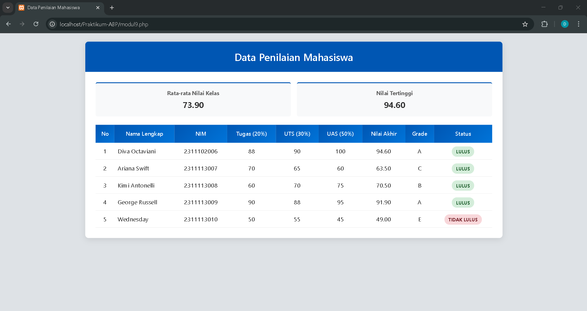

<div align="center">

## LAPORAN PRAKTIKUM <br> APLIKASI BERBASIS PLATFORM

<br>

### MODUL 9
### PHP

<br>
<br>


<br>
<br>
<br>

**Disusun oleh:**

**Diva Octaviani**  
**2311102006**  

<br>

**KELAS PS1IF-11-REG01**

**Dosen: Dimas Fanny Hebrasianto Permadi, S.ST., M.Kom**

<br><br>

## PROGRAM STUDI S1 TEKNIK INFORMATIKA <br> FAKULTAS INFORMATIKA <br> UNIVERSITAS TELKOM PURWOKERTO <br> 2026 <br><br>

</div>

---

## 1. Dasar Teori

### Web Server dan Server Side Scripting
*Web Server* merupakan sebuah perangkat lunak *server* yang berfungsi menerima permintaan (*request*) berupa halaman *web* melalui protokol HTTP atau HTTPS dari *client* yang dikenal dengan *web browser* dan mengirimkan kembali (*response*) hasilnya dalam bentuk halaman-halaman web yang umumnya berbentuk dokumen HTML. Beberapa contoh *Web Server* yang banyak digunakan antara lain adalah Apache Web Server, Internet Information Services (IIS), Xitami Web Server, dan Sun Java System Web Server. 

*Server Side Scripting* merupakan sebuah teknologi *scripting* atau pemrograman web dimana *script* (program) dikompilasi atau diterjemahkan di *server*, sehingga memungkinkan untuk menghasilkan halaman *web* yang dinamis. Contoh *Server Side Scripting* meliputi ASP/ASP.NET, ColdFusion, Java Server Pages (JSP), Perl, Python, dan PHP.

### PHP
PHP (*Hypertext Preprocessor*) adalah bahasa pemrograman berbasis *web* yang memiliki beberapa keistimewaan, yaitu: Cepat dalam eksekusi *script*, *Free* atau *open source*, Mudah dipelajari karena sintaks mirip dengan C/Java, *Multi-platform* dapat berjalan di Windows/Linux/macOS, memiliki Dukungan *technical support* yang baik, Banyaknya komunitas PHP yang aktif, dan bersifat Aman dengan keamanan terus dikembangkan.

### Variabel dan Tipe Data PHP
Variabel pada PHP digunakan untuk menyimpan sebuah *value* (nilai), data, atau informasi. Variabel ditandai dengan simbol `$` di awal namanya dan bersifat *case sensitive*. PHP mendukung 8 tipe data yaitu *Boolean, Integer, Float, String, Array, Object, Resource,* dan *NULL*. PHP termasuk *loosely typed language* dimana tipe data variabel tidak perlu dideklarasikan secara eksplisit karena akan ditentukan otomatis oleh interpreter.

### Konstanta
Konstanta merupakan variabel konstan yang nilainya tidak dapat diubah setelah didefinisikan. Untuk mendefinisikan konstanta pada PHP digunakan fungsi `define()` dengan sintaks `define("NAMA_KONSTANTA", nilai)`.

### Operator dalam PHP
PHP menyediakan berbagai jenis operator untuk melakukan operasi pada variabel atau nilai. Operator Aritmatika meliputi penjumlahan (`+`), pengurangan (`-`), perkalian (`*`), pembagian (`/`), dan modulus (`%`). Operator Perbandingan digunakan untuk membandingkan dua nilai, meliputi sama dengan (`==`), identik (`===`), tidak sama (`!=`, `<>`), lebih kecil/kurang dari (`<`), lebih besar dari (`>`), kurang dari atau sama dengan (`<=`), dan lebih dari atau sama dengan (`>=`). Operator Logika meliputi AND (`&&`, `and`), OR (`||`, `or`), XOR (`xor`), dan NOT (`!`).

### Struktur Kondisi
Struktur kondisi pada PHP digunakan untuk pengambilan keputusan berdasarkan kondisi tertentu. Terdapat dua jenis struktur kondisi utama: `if-then-else` yang mengevaluasi ekspresi boolean dan mengeksekusi blok kode jika kondisi *TRUE* atau *FALSE*, serta `switch-case` yang membandingkan nilai variabel dengan beberapa kemungkinan nilai (*case*) dan mengeksekusi blok kode yang sesuai. 

### Perulangan (Looping)
Perulangan pada PHP digunakan untuk mengeksekusi blok kode secara berulang. Jenis-jenis perulangan meliputi: `for` untuk perulangan dengan *counter* yang jelas, `while` untuk perulangan selama kondisi bernilai *TRUE*, `do-while` yang minimal mengeksekusi satu kali sebelum mengecek kondisi, dan `foreach` yang khusus digunakan untuk iterasi array.

### Function
Fungsi pada PHP digunakan untuk mengelompokkan sekumpulan statement yang melakukan tugas tertentu sehingga dapat dipanggil berkali-kali tanpa menulis ulang code. Fungsi dapat memiliki parameter (*input*) dan *return value* (*output*). Keuntungan menggunakan fungsi adalah mengurangi duplikasi kode, memudahkan *maintenance*, dan meningkatkan keterbacaan program.

### Array
*Array* pada PHP adalah tipe data terstruktur yang menyimpan sekumpulan data dengan tipe sama dalam satu variabel. Terdapat dua jenis array: `Indexed Array` yang menggunakan indeks numerik (0, 1, 2, ...) dan `Associative Array` yang menggunakan *key* berupa *string* untuk mengakses nilai. *Array* asosiatif sangat berguna untuk menyimpan data terstruktur seperti data mahasiswa dengan atribut nama, nim, dan nilai-nilai.

---

## 2. Hasil Praktikum

### a. Source Code

Pada Tugas Modul 9 ini, dikembangkan aplikasi Sistem Penilaian Mahasiswa yang menerapkan konsep *array* asosiatif untuk penyimpanan data, *function* untuk kalkulasi nilai, struktur kondisi untuk penentuan *grade* dan status kelulusan, operator aritmatika dan perbandingan untuk proses perhitungan, serta perulangan untuk menampilkan data dalam tabel HTML.

---

### `modul9.php`

```php
<?php

// Array asosiasi data mahasiswa
 $mahasiswa = [
    [
        'nama' => 'Diva Octaviani',
        'nim'  => '2311102006',
        'tugas' => 88,
        'uts'   => 90,
        'uas'   => 100
    ],
    [
        'nama' => 'Ariana Swift',
        'nim'  => '2311113007',
        'tugas' => 70,
        'uts'   => 65,
        'uas'   => 60
    ],
    [
        'nama' => 'Kimi Antonelli',
        'nim'  => '2311113008',
        'tugas' => 60,
        'uts'   => 70,
        'uas'   => 75
    ],
    [
        'nama' => 'George Russell',
        'nim'  => '2311113009',
        'tugas' => 90,
        'uts'   => 88,
        'uas'   => 95
    ],
    [
        'nama' => 'Wednesday',
        'nim'  => '2311113010',
        'tugas' => 50,
        'uts'   => 55,
        'uas'   => 45
    ]
];

// Function untuk menghitung nilai akhir
function hitungNilai($tugas, $uts, $uas) {
    $nilai_akhir = ($tugas * 0.20) + ($uts * 0.30) + ($uas * 0.50);
    return $nilai_akhir;
}

// Hitung total nilai untuk rata-rata dan cari nilai tertinggi
 $total_nilai = 0;
 $nilai_max = 0;
foreach ($mahasiswa as $mhs) {
    $na = hitungNilai($mhs['tugas'], $mhs['uts'], $mhs['uas']);
    $total_nilai += $na;
    if ($na > $nilai_max) {
        $nilai_max = $na;
    }
}

// Rata-rata kelas
 $rata_rata = $total_nilai / count($mahasiswa);
?>

<!DOCTYPE html>
<html lang="id">
<head>
    <meta charset="UTF-8">
    <meta name="viewport" content="width=device-width, initial-scale=1.0">
    <title>Data Penilaian Mahasiswa</title>
    <style>
        body {
            font-family: 'Segoe UI', Tahoma, Geneva, Verdana, sans-serif;
            background-color: #dee2e6;
            margin: 0;
            padding: 20px;
            color: #333;
        }

        .container {
            max-width: 1000px;
            margin: 0 auto;
            background: #ffffff;
            border-radius: 8px;
            box-shadow: 0 4px 15px rgba(0,0,0,0.1);
            overflow: hidden;
        }

        .header {
            background-color: #0056b3;
            color: white;
            padding: 20px;
            text-align: center;
        }

        .header h2 {
            margin: 0;
            font-size: 24px;
            font-weight: 600;
        }

        .content {
            padding: 25px;
        }

        table {
            width: 100%;
            border-collapse: collapse;
            margin-top: 20px;
        }
        
        th {
            background: linear-gradient(135deg, #0056b3, #0074d9);
            color: #ffffff;
            font-weight: 600;
            font-size: 13px;
            padding: 13px 8px;
            letter-spacing: 0.3px;
        }

        td {
            padding: 10px 8px;
            border-bottom: 1px solid #eee;
            text-align: center;
            font-size: 14px;
        }

        tbody tr:hover {
            background-color: #f1f8ff;
        }

        .badge {
            padding: 5px 10px;
            border-radius: 12px;
            font-size: 11px;
            font-weight: bold;
            text-transform: uppercase;
        }
        .lulus {
            background-color: #d4edda;
            color: #155724;
        }
        .tidak-lulus {
            background-color: #f8d7da;
            color: #721c24;
        }

        .stats-container {
            display: flex;
            gap: 15px;
            margin-bottom: 5px;
        }
        .stat-card {
            flex: 1;
            background: #f8f9fa;
            padding: 15px;
            border-radius: 5px;
            text-align: center;
            border-top: 3px solid #0056b3;
        }
        .stat-card h3 {
            margin: 0 0 5px 0;
            font-size: 13px;
            color: #666;
        }
        .stat-card p {
            margin: 0;
            font-size: 20px;
            font-weight: bold;
            color: #333;
        }
    </style>
</head>
<body>

<div class="container">
    <div class="header">
        <h2>Data Penilaian Mahasiswa</h2>
    </div>

    <div class="content">
        <div class="stats-container">
            <div class="stat-card">
                <h3>Rata-rata Nilai Kelas</h3>
                <p><?= number_format($rata_rata, 2); ?></p>
            </div>
            <div class="stat-card">
                <h3>Nilai Tertinggi</h3>
                <p><?= number_format($nilai_max, 2); ?></p>
            </div>
        </div>
        
        <!-- Tabel HTML untuk menampilkan seluruh data mahasiswa
             Output: Nama, NIM, Nilai Akhir, Grade, Status -->
        <table>
            <thead>
                <tr>
                    <th>No</th>
                    <th>Nama Lengkap</th>
                    <th>NIM</th>
                    <th>Tugas (20%)</th>
                    <th>UTS (30%)</th>
                    <th>UAS (50%)</th>
                    <th>Nilai Akhir</th>
                    <th>Grade</th>
                    <th>Status</th>
                </tr>
            </thead>
            <tbody>
                <?php $no = 1; ?>

                <!-- Loop (foreach) untuk menampilkan seluruh data mahasiswa -->
                <?php foreach ($mahasiswa as $mhs): ?>
                    <?php
                    $na = hitungNilai($mhs['tugas'], $mhs['uts'], $mhs['uas']);

                    // If/else untuk menentukan Grade menggunakan Operator Perbandingan (>=)
                    if ($na >= 85) { $grade = 'A'; } 
                    elseif ($na >= 70) { $grade = 'B'; } 
                    elseif ($na >= 60) { $grade = 'C'; } 
                    elseif ($na >= 50) { $grade = 'D'; } 
                    else { $grade = 'E'; }

                    // If/else untuk menentukan Status Kelulusan menggunakan operator perbandingan (>=)
                    if ($na >= 60) {
                        $status = 'LULUS';
                        $class_status = 'lulus';
                    } else {
                        $status = 'TIDAK LULUS';
                        $class_status = 'tidak-lulus';
                    }
                    ?>

                    <tr>
                        <td><?= $no++; ?></td>
                        <td style="text-align: left;"><?= $mhs['nama']; ?></td>
                        <td><?= $mhs['nim']; ?></td>
                        <td><?= $mhs['tugas']; ?></td>
                        <td><?= $mhs['uts']; ?></td>
                        <td><?= $mhs['uas']; ?></td>
                        <td><?= number_format($na, 2); ?></td>
                        <td><?= $grade; ?></td>
                        <td><span class="badge <?= $class_status; ?>"><?= $status; ?></span></td>
                    </tr>
                <?php endforeach; ?>
            </tbody>
        </table>
    </div>
</div>

</body>
</html>
```
Bagian penting dari kode tersebut meliputi:
- *Array* Asosiatif `$mahasiswa`: Menyimpan 5 data mahasiswa dengan *key* `nama`, `nim`, `tugas`, `uts`, `uas`.
- Fungsi `hitungNilai()`: Menghitung nilai akhir dengan operator aritmatika `*` dan `+`, formula: `(tugas×20%) + (UTS×30%) + (UAS×50%)`, mengembalikan nilai via *return*.
- Perulangan `foreach` untuk Statistik: `foreach ($mahasiswa as $mhs)` untuk iterasi, hitung total (`+=`), cari nilai tertinggi dengan operator `>`. Rata-rata menggunakan `/` dan `count()`.
- Struktur kondisi *If-ElseIf-Else* untuk *Grade*: Menentukan grade A-E menggunakan operator `>=` pada range nilai.
- Struktur kondisi *If-Else* untuk Status Kelulusan: Jika `≥ 60` → LULUS, `else` → TIDAK LULUS. Operator perbandingan `>=`.
- Perulangan `Foreach` untuk Tampilan Tabel: `foreach ($mahasiswa as $mhs): ... endforeach;` menampilkan semua data ke `<table>` dengan `<?= ?>` untuk output Nama, NIM, Nilai Akhir, Grade, Status.
- Output Statistik: `number_format()` menampilkan rata-rata kelas dan nilai tertinggi di kartu statistik.

---

### b. Screenshot Output

Langkah Menjalankan Program:

- Buka XAMPP, klik *Start* pada *service* Apache hingga berwarna hijau.
- Letakkan file `.php` di dalam folder `C:\xampp\htdocs\Praktikum-ABP` (sesuaikan nama folder).
- Buka browser, ketik `localhost/Praktikum-ABP/modul9.php` pada address bar, lalu Enter.

Berikut adalah tampilan output dari Data Penilaian Mahasiswa.



Halaman menampilkan Rata-rata Kelas: 73.90 dan Nilai Tertinggi: 94.60 pada kartu statistik, serta tabel 5 data mahasiswa dengan kolom lengkap (No, Nama, NIM, Tugas, UTS, UAS, Nilai Akhir, Grade, Status). Terdapat 4 mahasiswa LULUS (badge hijau) dengan grade A/B/C dan 1 mahasiswa TIDAK LULUS (badge merah) dengan grade E karena nilai di bawah 60.

---