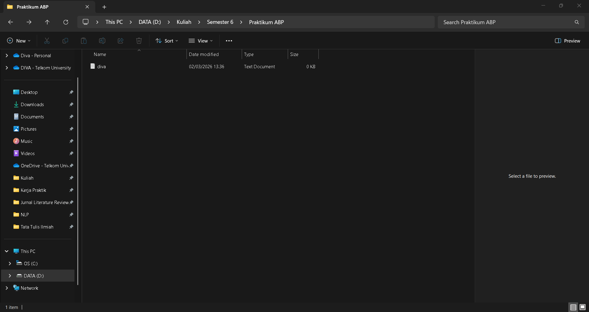
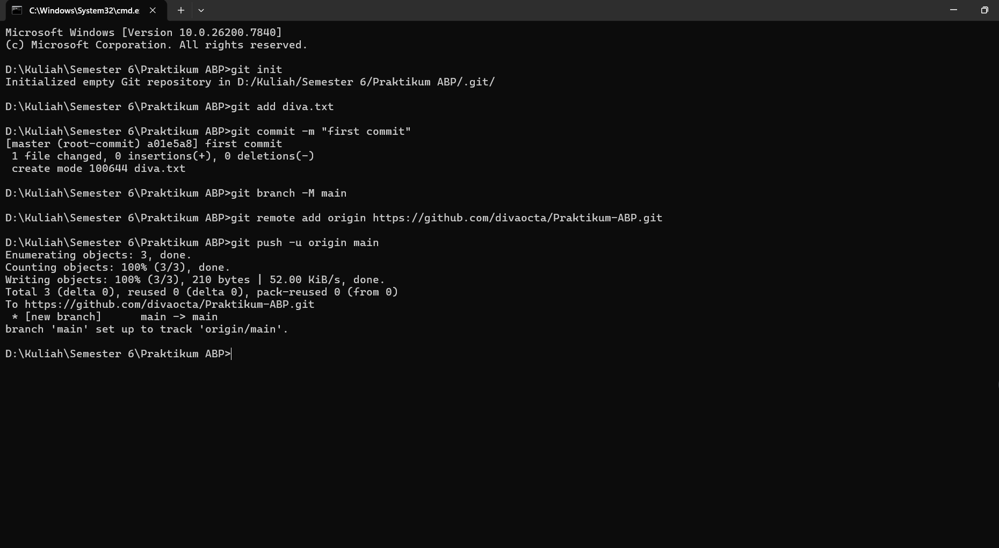
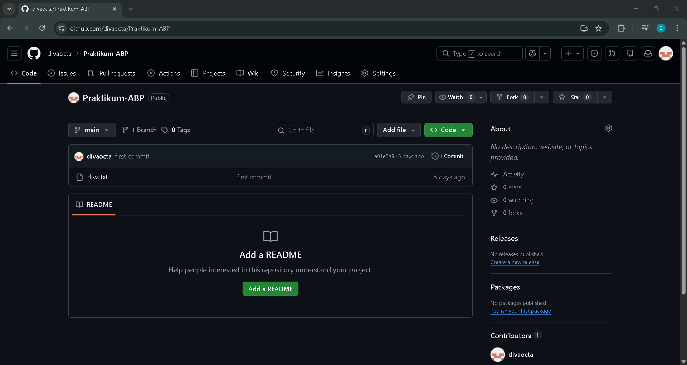

## LAPORAN PRAKTIKUM   APLIKASI BERBASIS PLATFORM
  
 

### MODUL 1 & 2
### PENGENALAN GIT 

 
 

 
 
 

**Disusun oleh:**

**Diva Octaviani**  
**2311102006**  

 

**KELAS PS1IF-11-REG01**

**Dosen: Dimas Fanny Hebrasianto Permadi, S.ST., M.Kom**

  

## PROGRAM STUDI S1 TEKNIK INFORMATIKA   FAKULTAS INFORMATIKA   UNIVERSITAS TELKOM PURWOKERTO   2026   

---

## 1. Dasar Teori

Git adalah sistem pengontrol versi (*Version Control System*) yang digunakan untuk mencatat dan mengelola perubahan pada file dalam suatu proyek. Dengan Git, pengguna dapat melacak riwayat perubahan serta mengatur berbagai versi dari kode yang dikerjakan.

GitHub adalah platform berbasis web yang digunakan untuk menyimpan dan mengelola repositori Git secara online. Melalui GitHub, pengguna dapat mengunggah, menyimpan, dan membagikan proyek agar dapat diakses dari mana saja.

Command Line Interface (CLI) adalah antarmuka berbasis teks yang memungkinkan pengguna berinteraksi dengan komputer melalui perintah yang diketik di terminal atau command prompt. Dalam Git, CLI digunakan untuk menjalankan perintah seperti membuat repositori, menambahkan file, melakukan *commit*, dan mengunggah proyek ke GitHub.

---

## 2. Langkah Praktikum

### **a. Membuat Repository di GitHub**

Klik New Repository, lalu isi nama repository sesuai kebutuhan dan klik Create Repository. Setelah repository berhasil dibuat, GitHub akan menampilkan halaman yang berisi panduan perintah Git yang dapat digunakan untuk menghubungkan repository lokal dengan repository di GitHub.

### **b. Menyiapkan Folder Proyek**

Buat folder proyek pada komputer untuk menyimpan file yang akan diunggah ke GitHub. Di dalam folder tersebut dapat dibuat file sederhana, seperti file README atau file teks sebagai contoh.

### **c. Menjalankan Perintah Git Melalui Command Prompt**

Buka Command Prompt melalui lokasi folder proyek yang telah dibuat dengan mengetik cmd pada address bar File Explorer, sehingga Command Prompt terbuka langsung pada direktori folder tersebut.

### **d. Memeriksa Repository di Github**

Buka kembali halaman repository di GitHub untuk memastikan file yang telah diunggah muncul di dalam repository. Jika file sudah terlihat, maka proses upload telah berhasil.

 
