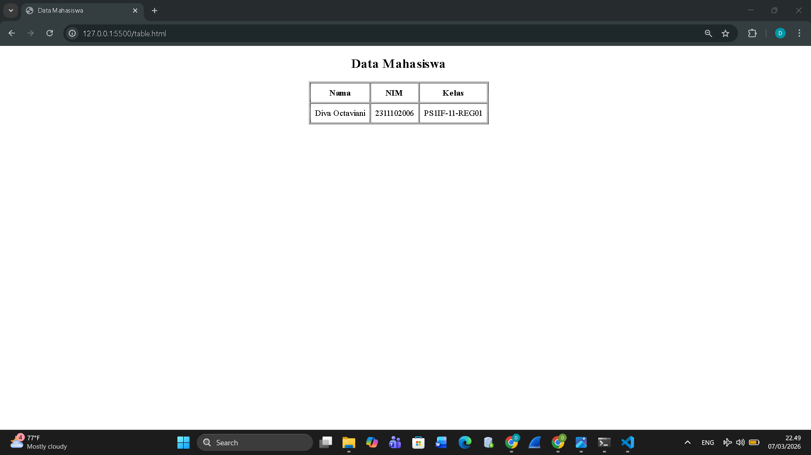

<div align="center">

## LAPORAN PRAKTIKUM <br> APLIKASI BERBASIS PLATFORM
  
<br>

### MODUL 3
### HTML  

<br>


<br>

**Disusun oleh:**

**Diva Octaviani**  
**2311102006**  

<br>

**KELAS PS1IF-11-REG01**

**Dosen: Dimas Fanny Hebrasianto Permadi, S.ST., M.Kom**

<br><br>

## PROGRAM STUDI S1 TEKNIK INFORMATIKA <br> FAKULTAS INFORMATIKA <br> UNIVERSITAS TELKOM PURWOKERTO <br> 2026 <br><br>

</div>

---

## 1. Dasar Teori

HTML (*HyperText Markup Language*) merupakan bahasa dasar yang digunakan untuk membuat dan menyusun struktur halaman web. HTML berfungsi untuk menampilkan berbagai elemen seperti teks, gambar, tabel, dan link di dalam browser.

HTML terdiri dari berbagai tag yang memiliki fungsi tertentu. Tag biasanya ditulis berpasangan, yaitu tag pembuka dan tag penutup. Contohnya `<html>...</html>` yang menandakan awal dan akhir dokumen HTML. Tag dalam HTML tidak semuanya berbentuk pasangan, ada beberapa tag yang hanya berdiri sendiri seperti tag `<br/>` yang berguna untuk berpindah baris.

Struktur dasar dokumen HTML umumnya terdiri dari beberapa elemen utama seperti `<!DOCTYPE html>` yang mendefinisikan jenis dokumen HTML, elemen `<html>` sebagai elemen utama halaman, `<head>` yang berisi informasi atau metadata dokumen, serta `<body>` yang berisi seluruh konten yang akan ditampilkan pada halaman web seperti teks, heading, tabel, maupun elemen lainnya. Selain itu, HTML juga memiliki atribut yang berfungsi sebagai informasi tambahan pada sebuah tag untuk mengatur atau memberikan keterangan tertentu pada elemen tersebut.


---

## 2. Hasil Praktikum

### **a. Source Code**

Berikut merupakan source code `table.html` yang digunakan untuk membuat tabel data mahasiswa menggunakan HTML tanpa CSS.

```html
<!DOCTYPE html>
<html>

<head>
    <title>Data Mahasiswa</title>
</head>

<body>

    <center>
        <h2>Data Mahasiswa</h2>

        <table border="1" cellpadding="8">
            <tr>
                <th>Nama</th>
                <th>NIM</th>
                <th>Kelas</th>
            </tr>
            <tr>
                <td>Diva Octaviani</td>
                <td>2311102006</td>
                <td>PS1IF-11-REG01</td>
            </tr>
        </table>
    </center>

</body>

</html>
```

Dokumen HTML terdiri dari beberapa bagian utama yaitu `<html>`, `<head>`, dan `<body>`. Pada bagian `<head>` terdapat tag `<title>` yang berfungsi untuk memberikan judul halaman. Sementara itu pada bagian `<body>` terdapat tag `<center>` yang digunakan untuk memposisikan seluruh elemen agar berada di tengah halaman tanpa menggunakan CSS. Di dalamnya, terdapat tag `<h2>` sebagai judul halaman serta tag `<table>` yang digunakan untuk membuat tabel. Struktur tabel dibentuk menggunakan tag `<tr>` sebagai baris tabel, `<th>` sebagai header atau judul kolom, dan `<td>` sebagai sel yang digunakan untuk mengisi data pada tabel.

### **b. Screenshot Output**

Berikut merupakan tampilan output yang dihasilkan dari source code tersebut.



Halaman menampilkan judul Data Mahasiswa yang berada di tengah halaman. Di bawah judul terdapat sebuah tabel dengan tiga kolom yaitu Nama, NIM, dan Kelas. Pada baris data ditampilkan informasi mahasiswa yaitu Diva Octaviani dengan NIM 2311102006 dan kelas PS1IF-11-REG01. Seluruh tampilan berada di tengah layar karena menggunakan tag `<center>`, sehingga tabel terlihat rapi meskipun tidak menggunakan CSS atau styling tambahan.

