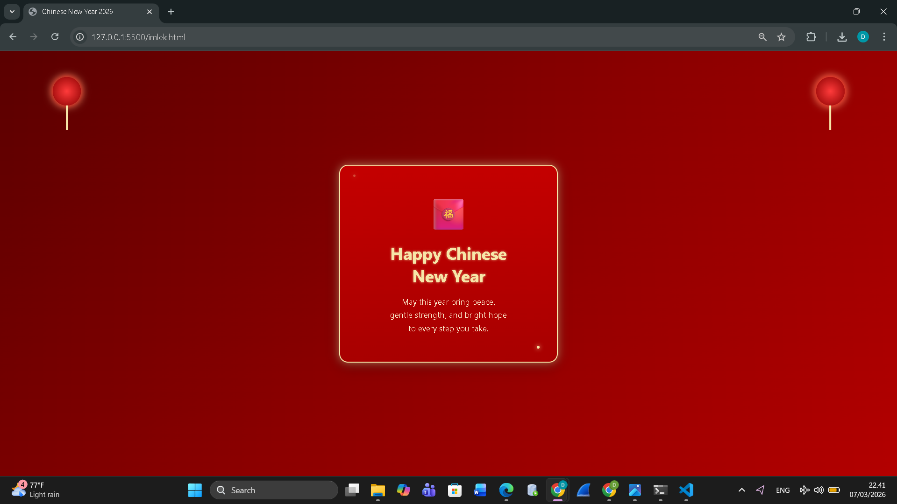

<div align="center">

## LAPORAN PRAKTIKUM <br> APLIKASI BERBASIS PLATFORM
  
<br>

### MODUL 4
### CSS – CASCADING STYLE SHEET 

<br>
<br>


<br>
<br>
<br>

**Disusun oleh:**

**Diva Octaviani**  
**2311102006**  

<br>

**KELAS PS1IF-11-REG01**

**Dosen: Dimas Fanny Hebrasianto Permadi, S.ST., M.Kom**

<br><br>

## PROGRAM STUDI S1 TEKNIK INFORMATIKA <br> FAKULTAS INFORMATIKA <br> UNIVERSITAS TELKOM PURWOKERTO <br> 2026 <br><br>

</div>

---

## 1. Dasar Teori

CSS (*Cascading Style Sheets*) merupakan bahasa yang digunakan untuk mengatur tampilan atau gaya dari sebuah halaman web yang dibuat menggunakan HTML. Dengan CSS, kita dapat mengatur berbagai aspek visual seperti warna, ukuran teks, posisi elemen, jarak, latar belakang, hingga animasi sehingga halaman web terlihat lebih menarik dan rapi.

CSS bekerja dengan cara memberikan aturan gaya pada elemen HTML melalui *selector*, *property*, dan *value*. *Selector* digunakan untuk menentukan elemen HTML yang akan diberi gaya, sedangkan *property* dan *value* digunakan untuk menentukan jenis tampilan yang ingin diterapkan, misalnya `color`, `font-size`, `background`, atau `margin`.

CSS dapat dituliskan dengan beberapa cara, salah satunya adalah external CSS, yaitu menuliskan kode CSS pada file terpisah dengan ekstensi `.css` lalu menghubungkannya ke file HTML menggunakan tag `<link>` pada bagian `<head>`. Dengan cara ini, pengaturan tampilan dapat dipisahkan dari struktur HTML sehingga kode menjadi lebih rapi dan mudah dikelola.


---

## 2. Hasil Praktikum

### **a. Source Code**

Berikut merupakan source code `imlek.html` yang digunakan untuk membuat halaman ucapan Chinese New Year serta file `style.css` yang digunakan untuk mengatur tampilan tanpa menggunakan library maupun JavaScript.

### **imlek.html**

```html
<!DOCTYPE html>
<html lang="en">

<head>
    <meta charset="UTF-8">
    <title>Chinese New Year 2026</title>
    <link rel="stylesheet" href="style.css">
</head>

<body>

    <div class="lantern left"></div>
    <div class="lantern right"></div>

    <div class="card">

        <div class="icon">🧧</div>

        <h1>Happy Chinese New Year</h1>

        <p>
            May this year bring peace,<br>
            gentle strength, and bright hope<br>
            to every step you take.
        </p>

        <div class="sparkle s1"></div>
        <div class="sparkle s2"></div>

    </div>

</body>

</html>
```
<br>

### **style.css**

```html
* {
    margin: 0;
    padding: 0;
    box-sizing: border-box;
}

body {

    height: 100vh;
    display: flex;
    justify-content: center;
    align-items: center;

    font-family: 'Segoe UI', sans-serif;

    background: linear-gradient(135deg,
            #5a0000,
            #8b0000,
            #b30000);

    overflow: hidden;
}

/* kartu */

.card {

    text-align: center;

    padding: 60px 70px;

    border-radius: 20px;

    background: linear-gradient(180deg,
            #c40000,
            #a80000);

    /* butter yellow */

    border: 3px solid #F6E6A8;

    box-shadow:
        0 0 20px rgba(246, 230, 168, 0.5),
        0 10px 30px rgba(0, 0, 0, 0.3);

    color: white;

    max-width: 500px;

    position: relative;
}

/* icon */

.icon {

    font-size: 70px;

    margin-bottom: 20px;

    animation: float 3s ease-in-out infinite;
}

/* judul */

h1 {

    font-size: 38px;

    margin-bottom: 20px;

    color: #F6E6A8;

    text-shadow: 0 0 6px rgba(246, 230, 168, 0.7);
}

/* teks */

p {

    font-size: 18px;

    line-height: 1.7;

    color: #fff7d6;
}

/* lampion */

.lantern {

    position: absolute;

    top: 60px;

    width: 65px;
    height: 65px;

    background: radial-gradient(circle, #ff3b3b, #8b0000);

    border-radius: 50%;

    box-shadow:
        0 0 15px red,
        0 0 20px #F6E6A8;
}

.lantern::after {

    content: "";

    width: 4px;
    height: 55px;

    background: #F6E6A8;

    position: absolute;

    bottom: -55px;
    left: 50%;

    transform: translateX(-50%);
}

.left {
    left: 120px;
}

.right {
    right: 120px;
}

/* sparkle */

.sparkle {

    position: absolute;

    width: 6px;
    height: 6px;

    background: #F6E6A8;

    border-radius: 50%;

    box-shadow: 0 0 10px #F6E6A8;

    animation: twinkle 2s infinite;
}

.s1 {
    top: 20px;
    left: 30px;
}

.s2 {
    bottom: 30px;
    right: 40px;
    animation-delay: 1s;
}

/* animasi */

@keyframes float {

    0% {
        transform: translateY(0);
    }

    50% {
        transform: translateY(-10px);
    }

    100% {
        transform: translateY(0);
    }

}

@keyframes twinkle {

    0% {
        opacity: 0.3;
    }

    50% {
        opacity: 1;
    }

    100% {
        opacity: 0.3;
    }

}
```

File `imlek.html` digunakan sebagai struktur utama halaman yang menampilkan ucapan *Happy Chinese New Year*. Pada bagian `<head>` terdapat tag `<title>` untuk judul halaman serta `<link>` yang menghubungkan file HTML dengan file CSS eksternal `style.css`. Di dalam `<body>` terdapat beberapa elemen `<div>` seperti `lantern` sebagai dekorasi lampion, `card` sebagai wadah utama konten, serta elemen `icon`, `h1`, dan `p` untuk menampilkan ikon, judul, dan pesan ucapan.

File `style.css` digunakan untuk mengatur tampilan halaman seperti posisi konten agar berada di tengah layar menggunakan `flexbox`, pemberian latar belakang gradasi merah, serta pengaturan tampilan kartu ucapan. CSS juga digunakan untuk menambahkan dekorasi lampion, efek cahaya, dan animasi sederhana sehingga halaman terlihat lebih menarik meskipun hanya menggunakan HTML dan CSS tanpa library maupun JavaScript.

### **b. Screenshot Output**

Berikut merupakan tampilan output yang dihasilkan dari source code tersebut.



Halaman menampilkan sebuah kartu ucapan Tahun Baru Imlek. Di dalamnya, terdapat ikon amplop merah, judul ucapan, serta pesan singkat untuk merayakan Tahun Baru Imlek. Pada sisi kiri dan kanan halaman terdapat dekorasi lampion berwarna merah yang memberikan nuansa khas perayaan Imlek. Selain itu terdapat efek cahaya kecil dan animasi sederhana pada ikon serta dekorasi yang membuat tampilan halaman terlihat lebih menarik meskipun hanya menggunakan HTML dan CSS tanpa library maupun JavaScript.

