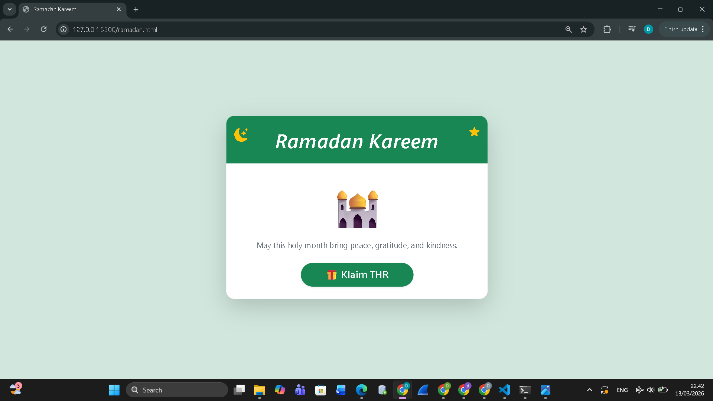
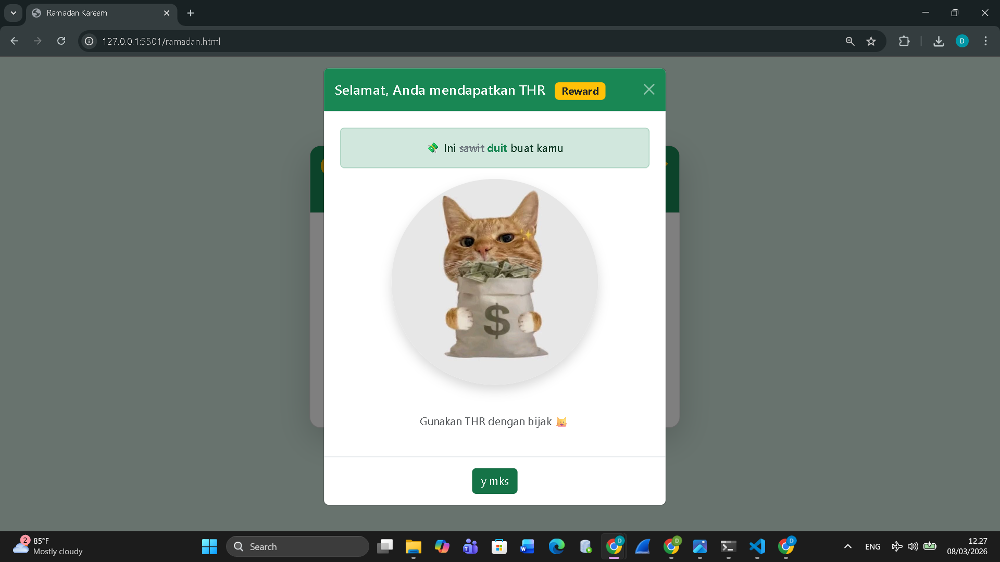

<div align="center">

## LAPORAN PRAKTIKUM <br> APLIKASI BERBASIS PLATFORM
  
<br>

### MODUL 5
### BOOTSTRAP

<br>
<br>


<br>
<br>
<br>

**Disusun oleh:**

**Diva Octaviani**  
**2311102006**  

<br>

**KELAS PS1IF-11-REG01**

**Dosen: Dimas Fanny Hebrasianto Permadi, S.ST., M.Kom**

<br><br>

## PROGRAM STUDI S1 TEKNIK INFORMATIKA <br> FAKULTAS INFORMATIKA <br> UNIVERSITAS TELKOM PURWOKERTO <br> 2026 <br><br>

</div>

---

## 1. Dasar Teori

Bootstrap merupakan *framework* CSS yang digunakan untuk mempermudah proses pembuatan tampilan website agar lebih rapi, responsif, dan menarik tanpa harus menulis banyak kode CSS secara manual. Bootstrap menyediakan berbagai komponen siap pakai seperti *grid system*, *card*, tombol, ikon, dan berbagai *class utility* yang dapat langsung digunakan pada elemen HTML.

Dengan menggunakan Bootstrap, kita dapat membuat tampilan halaman web yang konsisten dan dapat menyesuaikan ukuran layar perangkat, baik pada komputer maupun perangkat mobile. Pada praktikum ini, Bootstrap digunakan untuk membuat halaman bertema Ramadan tanpa CSS tambahan.

---

## 2. Hasil Praktikum

### **a. Source Code**

Berikut merupakan source code `ramadan.html` pengembangan dari Tugas 4 sebelumnya untuk menampilkan modal THR interaktif.

```html
<!DOCTYPE html>
<html lang="en">

<head>
    <meta charset="UTF-8">
    <meta name="viewport" content="width=device-width, initial-scale=1.0">
    <title>Ramadan Kareem</title>

    <link href="https://cdn.jsdelivr.net/npm/bootstrap@5.3.0/dist/css/bootstrap.min.css" rel="stylesheet">
    <link rel="stylesheet" href="https://cdn.jsdelivr.net/npm/bootstrap-icons@1.10.5/font/bootstrap-icons.css">

</head>

<body class="bg-success-subtle min-vh-100">

    <div class="container min-vh-100 d-flex align-items-center justify-content-center">

        <div class="card shadow-lg rounded-4 overflow-hidden text-center col-lg-5 col-md-7">

            <div class="card-header bg-success text-white position-relative p-4">

                <i class="bi bi-moon-stars-fill text-warning position-absolute top-0 start-0 mt-2 ms-3 fs-3"></i>

                <i class="bi bi-star-fill text-warning position-absolute top-0 end-0 mt-2 me-3 fs-4"></i>

                <h1 class="display-6 fst-italic fw-semibold m-0">
                    Ramadan Kareem
                </h1>

            </div>

            <div class="card-body p-5">

                <div class="display-1 mb-4">
                    🕌
                </div>

                <p class="text-secondary mb-4">
                    May this holy month bring peace, gratitude, and kindness.
                </p>

                <button class="btn btn-success btn-lg shadow" data-bs-toggle="modal" data-bs-target="#thrModal">
                    🎁 Klaim THR
                </button>

            </div>

        </div>

    </div>


    <!-- MODAL -->

    <div class="modal fade" id="thrModal" tabindex="-1">

        <div class="modal-dialog modal-dialog-centered">

            <div class="modal-content text-center">

                <div class="modal-header bg-success text-white">

                    <h5 class="modal-title">
                        Selamat, Anda mendapatkan THR
                        <span class="badge bg-warning text-dark ms-2">Reward</span>
                    </h5>

                    <button type="button" class="btn-close btn-close-white" data-bs-dismiss="modal"></button>

                </div>

                <div class="modal-body p-4">

                    <div class="alert alert-success fw-semibold">
                        💸 Ini <s class="text-secondary">sawit</s>
                        <span class="fw-bold text-success">duit</span> buat kamu
                    </div>

                    

                    <p class="text-muted mt-4">
                        Gunakan THR dengan bijak 😺
                    </p>

                </div>

                <div class="modal-footer justify-content-center">

                    <button class="btn btn-success" data-bs-dismiss="modal">
                        y mks
                    </button>

                </div>

            </div>

        </div>

    </div>


    <script src="https://cdn.jsdelivr.net/npm/bootstrap@5.3.0/dist/js/bootstrap.bundle.min.js"></script>

</body>

</html>
```

Pada pengembangan halaman *Ramadan Kareem* kali ini, ditambahkan sebuah tombol `Klaim THR` menggunakan class `btn btn-success btn-lg` dari Bootstrap. Tombol ini mengaktifkan modal Bootstrap untuk membuat tampilan di tengah layar saat diklik. Modal menampilkan pesan interaktif, badge *Reward*, gambar dekoratif, serta tombol penutup modal. Semua elemen tetap menggunakan komponen Bootstrap tanpa CSS tambahan, sehingga tampilan tetap konsisten dan responsif.

### **b. Screenshot Output**

Berikut merupakan tampilan output yang dihasilkan dari source code tersebut.





Hasil tampilan menunjukkan halaman dengan latar belakang *soft green*, kartu putih di tengah layar yang berjudul “Ramadan Kareem”, beberapa ikon menarik, dan juga tombol klaim THR. Ketika tombol diklik, muncul modal di tengah layar berisi pesan THR dan juga elemen yang tersusun rapi dan interaktif, memanfaatkan sepenuhnya komponen Bootstrap.

