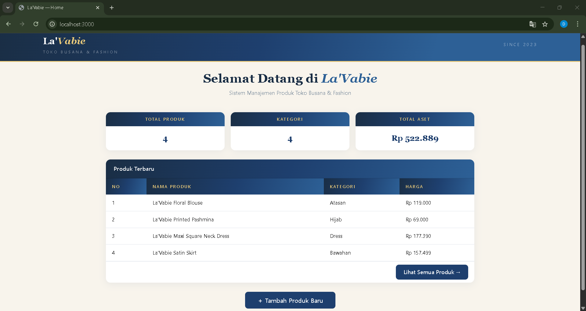
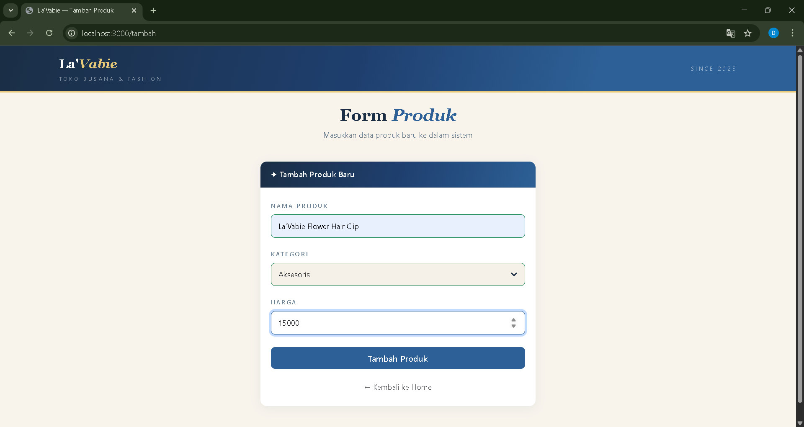
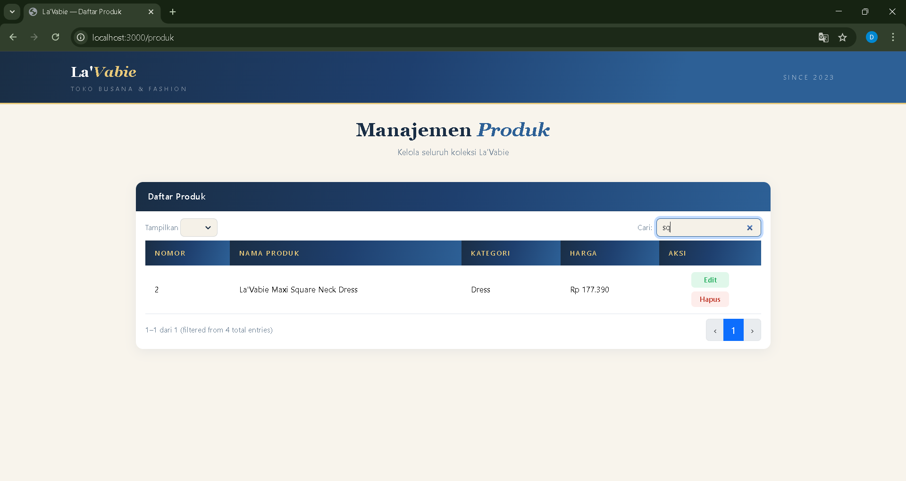
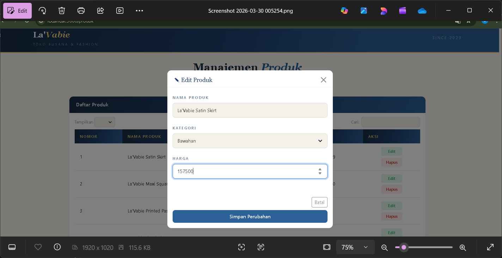
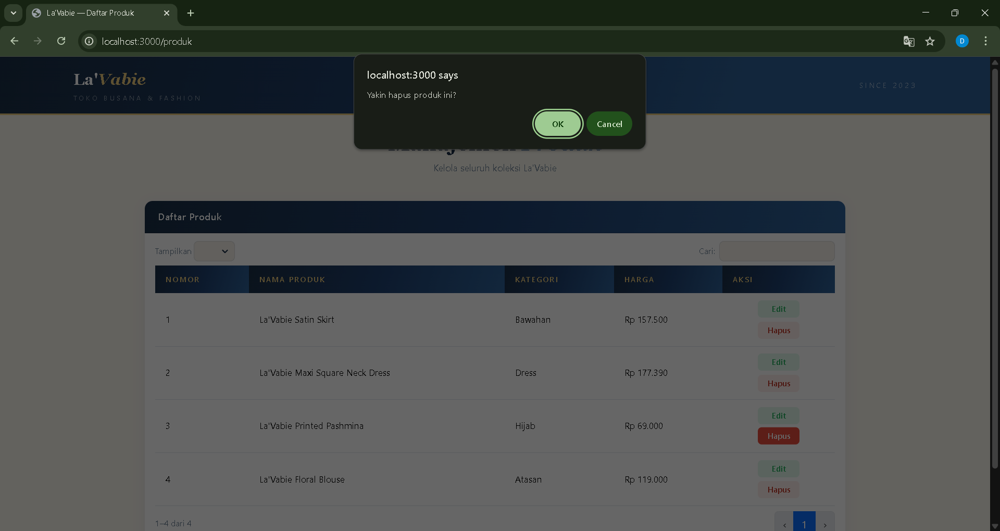

<div align="center">

## LAPORAN PRAKTIKUM <br> APLIKASI BERBASIS PLATFORM

<br>

### TUGAS COTS 2
### MANAJEMEN PRODUK

<br>
<br>


<br>
<br>
<br>

**Disusun oleh:**

**Diva Octaviani**  
**2311102006**  

<br>

**KELAS PS1IF-11-REG01**

**Dosen: Dimas Fanny Hebrasianto Permadi, S.ST., M.Kom**

<br><br>

## PROGRAM STUDI S1 TEKNIK INFORMATIKA <br> FAKULTAS INFORMATIKA <br> UNIVERSITAS TELKOM PURWOKERTO <br> 2026 <br><br>

</div>

---

## 1. Dasar Teori

### Bootstrap
Bootstrap adalah framework CSS populer yang memudahkan pengembangan antarmuka web responsif dan modern. Framework ini menyediakan berbagai komponen siap pakai seperti navbar, card, form, dan modal yang dapat dikustomisasi sesuai kebutuhan.

### jQuery
jQuery adalah library JavaScript yang membantu mempermudah pengelolaan elemen pada halaman web. Dengan jQuery, interaksi seperti klik tombol, animasi, atau perubahan konten dapat ditangani dengan kode yang lebih singkat dan mudah dibaca.

### DataTables
DataTables adalah plugin jQuery yang menyediakan fitur pencarian real-time, pagination, dan pengurutan data pada tabel sehingga pengguna dapat mencari atau memilah data dengan mudah tanpa harus memuat ulang halaman. Pada tugas ini, DataTables dikonfigurasi menggunakan Ajax yang mengambil data JSON dari REST API Express.

### jQuery Validation Plugin
jQuery Validation Plugin adalah plugin jQuery yang digunakan untuk memvalidasi input form di sisi klien sebelum data dikirim ke server. Plugin ini mendukung berbagai aturan validasi seperti required, minlength, digits, dan min, serta memungkinkan kustomisasi pesan error. Pada tugas ini, plugin digunakan untuk memvalidasi form tambah produk dan form edit produk dengan pesan error dalam Bahasa Indonesia.

### Node.js dan Express
Node.js adalah runtime JavaScript berbasis server yang memungkinkan JavaScript dijalankan di luar browser. Express adalah framework minimalis untuk Node.js yang memudahkan pembuatan REST API dan server web. Pada tugas ini, Express digunakan sebagai backend server yang menyediakan endpoint API untuk operasi CRUD, melayani file statis dari folder `public`, serta me-render halaman menggunakan template engine EJS.

### EJS (Embedded JavaScript Templates)
EJS adalah template engine untuk Node.js yang memungkinkan pembuatan halaman HTML dinamis dengan menyisipkan kode JavaScript langsung di dalam file HTML. Pada tugas ini, EJS digunakan untuk membangun tampilan multi-halaman yang berbagi satu layout bersama (`layout.ejs`).

### REST API dan JSON
REST API (*Representational State Transfer*) adalah arsitektur komunikasi antara frontend dan backend menggunakan protokol HTTP. Data dikirim dan diterima dalam format JSON (*JavaScript Object Notation*). Pada tugas ini, data produk disimpan dalam file `data.json` di server dan diakses melalui endpoint API yang mendukung operasi GET, POST, PUT, dan DELETE.

### CRUD
CRUD (*Create*, *Read*, *Update*, dan *Delete*) adalah empat operasi dasar dalam pengelolaan data. Pada tugas ini, CRUD diimplementasikan melalui REST API dengan penyimpanan permanen di file `data.json` pada server, sehingga data tidak hilang meskipun halaman di-refresh.

---

## 2. Hasil Praktikum

### a. Source Code

Pada Tugas 2 COTS ini, dikembangkan aplikasi web Manajemen Produk La'Vabie menggunakan Node.js (Express) sebagai backend dengan template engine EJS, serta Bootstrap 5 sebagai framework styling. Aplikasi terdiri dari tiga halaman utama — Home, Tambah Produk, dan Daftar Produk — yang semuanya berbagi satu layout bersama. Berikut adalah penjelasan setiap file utama.

---

### `package.json`

File ini mendefinisikan metadata proyek dan seluruh dependency yang dibutuhkan.

```json
{
    "name": "lavabie-cots2",
    "version": "1.0.0",
    "main": "server.js",
    "dependencies": {
        "body-parser": "^1.20.2",
        "ejs": "^5.0.1",
        "express": "^4.18.2"
    }
}
```

---

### `server.js`

File ini adalah inti backend aplikasi yang dibangun menggunakan Express. Server menyediakan empat endpoint REST API untuk operasi CRUD, route untuk merender halaman EJS, serta middleware CORS agar frontend dapat mengakses API dari origin yang berbeda. Data produk disimpan secara permanen dalam file `data.json`.

```javascript
const express = require('express');
const bodyParser = require('body-parser');
const fs = require('fs');
const path = require('path');

const app = express();
const PORT = 3000;

app.set('view engine', 'ejs');
app.set('views', path.join(__dirname, 'views'));

app.use(bodyParser.json());

app.use((req, res, next) => {
    res.header('Access-Control-Allow-Origin', '*');
    res.header('Access-Control-Allow-Methods', 'GET, POST, PUT, DELETE, OPTIONS');
    res.header('Access-Control-Allow-Headers', 'Content-Type');
    if (req.method === 'OPTIONS') return res.sendStatus(200);
    next();
});

app.use(express.static('public'));

const DB_PATH = path.join(__dirname, 'data.json');

const getDB = () => {
    if (!fs.existsSync(DB_PATH)) {
        fs.writeFileSync(DB_PATH, JSON.stringify({ products: [], nextId: 1 }, null, 2));
    }
    return JSON.parse(fs.readFileSync(DB_PATH));
};

const saveDB = (data) => {
    fs.writeFileSync(DB_PATH, JSON.stringify(data, null, 2));
};

// Page Routes
app.get('/', (req, res) => res.render('home'));
app.get('/tambah', (req, res) => res.render('tambah'));
app.get('/produk', (req, res) => res.render('produk'));

// API Routes
app.get('/api/products', (req, res) => {
    const db = getDB();
    res.json({ data: db.products });
});

app.post('/api/products', (req, res) => {
    const db = getDB();
    const { nama, kategori, harga } = req.body;
    const newProduct = { id: db.nextId, nama, kategori, harga: Number(harga) };
    db.products.push(newProduct);
    db.nextId++;
    saveDB(db);
    res.json({ success: true, message: 'Produk ditambahkan' });
});

app.put('/api/products/:id', (req, res) => {
    const db = getDB();
    const id = parseInt(req.params.id);
    const { nama, kategori, harga } = req.body;
    const index = db.products.findIndex(p => p.id === id);
    if (index !== -1) {
        db.products[index] = { id, nama, kategori, harga: Number(harga) };
        saveDB(db);
        res.json({ success: true });
    } else {
        res.status(404).json({ success: false });
    }
});

app.delete('/api/products/:id', (req, res) => {
    const db = getDB();
    const id = parseInt(req.params.id);
    db.products = db.products.filter(p => p.id !== id);
    saveDB(db);
    res.json({ success: true });
});

app.listen(PORT, () => {
    console.log(`Server La'Vabie berjalan di http://localhost:${PORT}`);
});
```

Bagian penting dari `server.js` meliputi:
- **View Engine EJS**: Server dikonfigurasi menggunakan EJS sebagai template engine untuk merender halaman HTML secara dinamis.
- **CORS Middleware**: Mengizinkan request dari origin yang berbeda sehingga frontend dapat mengakses API dengan bebas.
- **Static File Serving**: Menyajikan file CSS, JS, dan aset lain dari folder `public` melalui Express.
- **Page Routes**: Tiga route (`/`, `/tambah`, `/produk`) yang masing-masing merender file EJS yang sesuai.
- **REST API Endpoints**: Empat route (GET, POST, PUT, DELETE) yang menangani seluruh operasi CRUD pada data produk.
- **File-based Storage**: Data disimpan ke file `data.json` menggunakan `fs.writeFileSync` sehingga data bersifat persisten.

---

### `views/layout.ejs`

File ini adalah template utama yang digunakan bersama oleh seluruh halaman. Semua library eksternal (Bootstrap, DataTables, jQuery, jQuery Validation) di-load di sini, sehingga tidak perlu diulang di setiap halaman.

```html
<!DOCTYPE html>
<html lang="id">
<head>
    <meta charset="UTF-8" />
    <meta name="viewport" content="width=device-width,initial-scale=1.0" />
    <title>La'Vabie — <%= title %></title>
    <link href="https://cdn.jsdelivr.net/npm/bootstrap@5.3.2/dist/css/bootstrap.min.css" rel="stylesheet" />
    <link href="https://cdn.datatables.net/1.13.6/css/dataTables.bootstrap5.min.css" rel="stylesheet" />
    <link href="/style.css" rel="stylesheet" />
</head>
<body>

    <nav class="navbar">
        <div class="container d-flex justify-content-between align-items-center">
            <div>
                <a href="/" style="text-decoration:none;">
                    <span class="brand-name">La'<em>Vabie</em></span>
                    <div class="brand-sub">TOKO BUSANA & FASHION</div>
                </a>
            </div>
            <span class="nav-right">SINCE 2023</span>
        </div>
    </nav>

    <div class="page-header">
        <div class="container">
            <h1 class="page-title"><%- pageTitle %></h1>
            <p class="page-sub"><%= pageSub %></p>
        </div>
    </div>

    <div class="container pb-5">
        <%- body %>
    </div>

    <div class="toast align-items-center" id="toast" role="alert">
        <div class="d-flex">
            <div class="toast-body" id="toastMsg"></div>
            <button type="button" class="btn-close btn-close-white me-2 m-auto" data-bs-dismiss="toast"></button>
        </div>
    </div>

    <script src="https://code.jquery.com/jquery-3.7.1.min.js"></script>
    <script src="https://cdn.jsdelivr.net/npm/bootstrap@5.3.2/dist/js/bootstrap.bundle.min.js"></script>
    <script src="https://cdn.datatables.net/1.13.6/js/jquery.dataTables.min.js"></script>
    <script src="https://cdn.datatables.net/1.13.6/js/dataTables.bootstrap5.min.js"></script>
    <script src="https://cdn.jsdelivr.net/npm/jquery-validation@1.19.5/dist/jquery.validate.min.js"></script>
    <script src="/js/app.js"></script>
</body>
</html>
```

Bagian penting dari `layout.ejs` meliputi:
- **CDN Links**: Menghubungkan halaman dengan Bootstrap, DataTables, jQuery, dan jQuery Validation Plugin tanpa perlu mengunduh file manual.
- **Shared Navbar & Header**: Navbar dan page header dirender sekali dan digunakan oleh semua halaman melalui variabel EJS (`title`, `pageTitle`, `pageSub`).
- **`<%- body %>`**: Variabel EJS yang menjadi tempat konten spesifik setiap halaman disisipkan.
- **Toast Notification**: Komponen notifikasi Bootstrap yang muncul di pojok kanan bawah sebagai feedback setelah operasi CRUD.

---

### `views/home.ejs`

File ini adalah halaman utama (dashboard) yang menampilkan statistik ringkasan (total produk, jumlah kategori, total aset) dan tabel lima produk terbaru.

```html
<%
    title = "Home";
    pageTitle = "Selamat Datang di <em>La'Vabie</em>";
    pageSub = "Sistem Manajemen Produk Toko Busana & Fashion";
    body = `
    <div class="row justify-content-center g-4">
    <div class="col-md-9">
        <div class="row g-3 mb-4">
            <div class="col-4">
                <div class="stat-card">
                    <div class="stat-card-header">TOTAL PRODUK</div>
                    <div class="stat-card-body">
                        <div class="stat-value" id="statTotal">—</div>
                    </div>
                </div>
            </div>
            <div class="col-4">
                <div class="stat-card">
                    <div class="stat-card-header">KATEGORI</div>
                    <div class="stat-card-body">
                        <div class="stat-value" id="statKategori">—</div>
                    </div>
                </div>
            </div>
            <div class="col-4">
                <div class="stat-card">
                    <div class="stat-card-header">TOTAL ASET</div>
                    <div class="stat-card-body">
                        <div class="stat-value" id="statNilai">—</div>
                    </div>
                </div>
            </div>
        </div>

        <div class="card">
            <div class="card-header">Produk Terbaru</div>
            <div class="card-body p-0">
                <table class="table mb-0" id="tabelHome">
                    <thead>
                        <tr>
                            <th>No</th>
                            <th>Nama Produk</th>
                            <th>Kategori</th>
                            <th>Harga</th>
                        </tr>
                    </thead>
                    <tbody id="bodyHome"></tbody>
                </table>
            </div>
            <div class="card-footer text-end" style="background:transparent;border-top:1px solid rgba(30,63,110,.08);">
                <a href="/produk" class="btn btn-primary btn-sm" style="width:auto;">Lihat Semua Produk →</a>
            </div>
        </div>

        <div class="text-center mt-2">
            <a href="/tambah" class="btn btn-primary" style="width:auto;padding:10px 32px;">＋ Tambah Produk Baru</a>
        </div>
    </div>
    </div>
    `;
%>
<%- include('layout') %>
```

Bagian penting dari `home.ejs` meliputi:
- **Variabel EJS**: `title`, `pageTitle`, `pageSub`, dan `body` ditetapkan di awal file, kemudian diteruskan ke `layout.ejs` melalui `include`.
- **Stat Cards**: Tiga kartu statistik yang nilainya diisi secara dinamis oleh `app.js` menggunakan `$.getJSON`.
- **Tabel Produk Terbaru**: Menampilkan lima produk terakhir yang ditambahkan, diambil dari API dan dirender oleh JavaScript.
- **Navigasi**: Tombol menuju halaman `/tambah` dan `/produk` tersedia di bagian bawah halaman.

---

### `views/tambah.ejs`

File ini adalah halaman Form untuk menambahkan produk baru ke dalam sistem.

```html
<%
    title = "Tambah Produk";
    pageTitle = "Form <em>Produk</em>";
    pageSub = "Masukkan data produk baru ke dalam sistem";
    body = `
    <div class="row justify-content-center">
    <div class="col-lg-5">
        <div class="card">
            <div class="card-header">✦ Tambah Produk Baru</div>
            <div class="card-body">
                <form id="form" novalidate>
                    <div class="mb-3">
                        <label class="form-label">Nama Produk</label>
                        <input type="text" id="nama" name="nama" class="form-control"
                            placeholder="e.g. Blouse Linen Cream" />
                    </div>
                    <div class="mb-3">
                        <label class="form-label">Kategori</label>
                        <select id="kategori" name="kategori" class="form-select">
                            <option value="">Pilih Kategori</option>
                            <option>Atasan</option>
                            <option>Bawahan</option>
                            <option>Dress</option>
                            <option>Hijab</option>
                            <option>Aksesoris</option>
                        </select>
                    </div>
                    <div class="mb-4">
                        <label class="form-label">Harga</label>
                        <input type="number" id="harga" name="harga" class="form-control"
                            placeholder="0" min="1" />
                    </div>
                    <button type="submit" class="btn btn-primary">Tambah Produk</button>
                    <a href="/" class="btn btn-link d-block text-center mt-3 text-muted"
                        style="text-decoration:none;font-size:0.9rem;">← Kembali ke Home</a>
                </form>
            </div>
        </div>
    </div>
    </div>
    `;
%>
<%- include('layout') %>
```

Bagian penting dari `tambah.ejs` meliputi:
- **Atribut `name` pada Input**: Wajib ditambahkan agar jQuery Validation Plugin dapat mengenali dan memvalidasi setiap field form.
- **`novalidate` pada Form**: Menonaktifkan validasi bawaan browser agar validasi sepenuhnya dikelola oleh jQuery Validation Plugin.
- **Tombol Kembali**: Tautan navigasi kembali ke halaman Home agar pengguna tidak terjebak di halaman form.

---

### `views/produk.ejs`

File ini adalah halaman Tabel yang menampilkan seluruh data produk menggunakan DataTables, sekaligus menyediakan modal untuk fitur Edit (Update).

```html
<% title="Daftar Produk" ; pageTitle="Manajemen <em>Produk</em>" ; pageSub="Kelola seluruh koleksi La'Vabie" ; body=`
    <div class="row g-4">
    <div class="col-lg-10 mx-auto">
        <div class="card">
            <div class="card-header">Daftar Produk</div>
            <div class="card-body p-0">
                <table id="tabel" class="table mb-0" style="width:100%">
                    <thead>
                        <tr>
                            <th>Nomor</th>
                            <th>Nama Produk</th>
                            <th>Kategori</th>
                            <th>Harga</th>
                            <th>Aksi</th>
                        </tr>
                    </thead>
                    <tbody></tbody>
                </table>
            </div>
        </div>
    </div>
    </div>

    <div class="modal fade" id="modalEdit" tabindex="-1">
        <div class="modal-dialog modal-dialog-centered">
            <div class="modal-content">
                <div class="modal-header">
                    <h5 class="modal-title">✎ Edit Produk</h5>
                    <button type="button" class="btn-close" data-bs-dismiss="modal"></button>
                </div>
                <div class="modal-body">
                    <form id="formEdit" novalidate>
                        <input type="hidden" id="editId">
                        <div class="mb-3">
                            <label class="form-label">Nama Produk</label>
                            <input type="text" id="editNama" name="editNama" class="form-control" />
                        </div>
                        <div class="mb-3">
                            <label class="form-label">Kategori</label>
                            <select id="editKategori" name="editKategori" class="form-select">
                                <option value="">Pilih Kategori</option>
                                <option>Atasan</option>
                                <option>Bawahan</option>
                                <option>Dress</option>
                                <option>Hijab</option>
                                <option>Aksesoris</option>
                            </select>
                        </div>
                        <div class="mb-4">
                            <label class="form-label">Harga</label>
                            <input type="number" id="editHarga" name="editHarga" class="form-control" min="1" />
                        </div>
                    </form>
                </div>
                <div class="modal-footer border-0 flex-column gap-2">
                    <button type="button" class="btn btn-primary w-100" id="btnUpdate">Simpan Perubahan</button>
                    <button type="button" class="btn btn-outline-secondary w-100" data-bs-dismiss="modal">Batal</button>
                </div>
            </div>
        </div>
    </div>
    `;
    %>
    <%- include('layout') %>
```

Bagian penting dari `produk.ejs` meliputi:
- **DataTables**: Tabel dengan `id="tabel"` diinisialisasi oleh `app.js` menggunakan DataTables Ajax, sehingga data diambil langsung dari API dalam format JSON.
- **Modal Edit**: Komponen Bootstrap Modal yang muncul saat tombol Edit diklik, berisi form yang sudah terisi data produk yang dipilih.
- **`<tbody>` Kosong**: Konten tabel tidak ditulis secara manual — sepenuhnya diisi oleh DataTables secara otomatis dari respons JSON API.

---

### `public/js/app.js`

File ini adalah logika utama aplikasi yang menangani inisialisasi DataTables, validasi form menggunakan jQuery Validation Plugin, pengisian statistik di halaman Home, serta seluruh operasi CRUD melalui Fetch API ke backend Express.

```javascript
const API_URL = 'http://localhost:3000/api/products';

// Format Rupiah
const rp = n => new Intl.NumberFormat('id-ID', {
    style: 'currency',
    currency: 'IDR',
    minimumFractionDigits: 0
}).format(n);

let dt, toastEl;

const showToast = (m) => {
    $('#toastMsg').text(m);
    toastEl.show();
};

$(document).ready(function () {

    // Init Toast
    toastEl = new bootstrap.Toast($('#toast')[0], { autohide: true, delay: 2500 });

    // Init DataTable (hanya berjalan di halaman /produk)
    dt = $('#tabel').DataTable({
        processing: true,
        ajax: { url: API_URL, dataSrc: 'data' },
        columns: [
            { data: null, render: (data, type, row, meta) => meta.row + 1 },
            { data: 'nama' },
            { data: 'kategori' },
            { data: 'harga', render: data => rp(data) },
            {
                data: 'id',
                render: id => `
                    <div class="action-buttons">
                        <button class="btn-edit" data-id="${id}">Edit</button>
                        <button class="btn-del" data-id="${id}">Hapus</button>
                    </div>`
            }
        ],
        ordering: false,
        language: {
            search: 'Cari:',
            lengthMenu: 'Tampilkan _MENU_',
            info: '_START_–_END_ dari _TOTAL_',
            infoEmpty: 'Tidak ada data',
            zeroRecords: 'Data tidak ditemukan',
            paginate: { next: '›', previous: '‹' }
        },
        pageLength: 5
    });

    // Validasi Form Tambah (jQuery Validation Plugin)
    $('#form').validate({
        rules: {
            nama: { required: true, minlength: 2 },
            kategori: { required: true },
            harga: { required: true, min: 1, digits: true }
        },
        messages: {
            nama: { required: 'Nama produk wajib diisi', minlength: 'Minimal 2 karakter' },
            kategori: { required: 'Pilih kategori terlebih dahulu' },
            harga: { required: 'Harga wajib diisi', min: 'Harga harus lebih dari 0', digits: 'Hanya boleh angka' }
        },
        errorClass: 'text-danger',
        errorElement: 'small',
        highlight: el => $(el).addClass('is-invalid').removeClass('is-valid'),
        unhighlight: el => $(el).removeClass('is-invalid').addClass('is-valid'),
        submitHandler: async function (form) {
            const payload = {
                nama: $('#nama').val().trim(),
                kategori: $('#kategori').val(),
                harga: $('#harga').val()
            };
            try {
                const res = await fetch(API_URL, {
                    method: 'POST',
                    headers: { 'Content-Type': 'application/json' },
                    body: JSON.stringify(payload)
                });
                if (!res.ok) throw new Error('Server error');
                showToast('✓ Produk berhasil ditambahkan');
                form.reset();
                $('#form input, #form select').removeClass('is-valid is-invalid');
                if (dt) dt.ajax.reload();
            } catch (err) {
                showToast('✗ Gagal menambahkan produk — pastikan server berjalan');
            }
        }
    });

    // Handle Hapus
    $(document).on('click', '.btn-del', async function () {
        const id = $(this).data('id');
        if (confirm('Yakin hapus produk ini?')) {
            try {
                await fetch(`${API_URL}/${id}`, { method: 'DELETE' });
                dt.ajax.reload();
                showToast('✓ Produk dihapus');
            } catch (err) {
                showToast('✗ Gagal menghapus produk');
            }
        }
    });

    // Handle Edit: Buka Modal dan isi data
    $(document).on('click', '.btn-edit', function () {
        const rowData = dt.row($(this).parents('tr')).data();
        $('#editId').val(rowData.id);
        $('#editNama').val(rowData.nama);
        $('#editKategori').val(rowData.kategori);
        $('#editHarga').val(rowData.harga);
        new bootstrap.Modal($('#modalEdit')[0]).show();
    });

    // Validasi Form Edit
    $('#formEdit').validate({
        rules: {
            editNama: { required: true, minlength: 2 },
            editKategori: { required: true },
            editHarga: { required: true, min: 1, digits: true }
        },
        messages: {
            editNama: { required: 'Nama produk wajib diisi', minlength: 'Minimal 2 karakter' },
            editKategori: { required: 'Pilih kategori terlebih dahulu' },
            editHarga: { required: 'Harga wajib diisi', min: 'Harga harus lebih dari 0', digits: 'Hanya boleh angka' }
        },
        errorClass: 'text-danger',
        errorElement: 'small',
        highlight: el => $(el).addClass('is-invalid').removeClass('is-valid'),
        unhighlight: el => $(el).removeClass('is-invalid').addClass('is-valid')
    });

    // Handle Update
    $('#btnUpdate').click(async function () {
        if (!$('#formEdit').valid()) return;
        const id = $('#editId').val();
        const data = {
            nama: $('#editNama').val(),
            kategori: $('#editKategori').val(),
            harga: $('#editHarga').val()
        };
        try {
            await fetch(`${API_URL}/${id}`, {
                method: 'PUT',
                headers: { 'Content-Type': 'application/json' },
                body: JSON.stringify(data)
            });
            bootstrap.Modal.getInstance($('#modalEdit')[0]).hide();
            dt.ajax.reload();
            showToast('✓ Produk diperbarui');
        } catch (err) {
            showToast('✗ Gagal memperbarui produk');
        }
    });

    // Reset validasi saat modal ditutup
    $('#modalEdit').on('hidden.bs.modal', function () {
        $('#formEdit input, #formEdit select').removeClass('is-valid is-invalid');
        $('#formEdit small.text-danger').remove();
    });

    // Statistik di Halaman Home
    if ($('#tabelHome').length) {
        $.getJSON(API_URL, function (res) {
            const products = res.data;
            const total = products.length;
            const kategori = [...new Set(products.map(p => p.kategori))].length;
            const nilai = products.reduce((sum, p) => sum + p.harga, 0);

            $('#statTotal').text(total);
            $('#statKategori').text(kategori);
            $('#statNilai').text(new Intl.NumberFormat('id-ID', {
                style: 'currency', currency: 'IDR', minimumFractionDigits: 0
            }).format(nilai));

            const recent = products.slice(-5).reverse();
            recent.forEach((p, i) => {
                $('#bodyHome').append(`
                    <tr>
                        <td>${i + 1}</td>
                        <td>${p.nama}</td>
                        <td>${p.kategori}</td>
                        <td>${rp(p.harga)}</td>
                    </tr>
                `);
            });

            if (total === 0) {
                $('#bodyHome').append(`<tr><td colspan="4" class="text-center text-muted py-3">Belum ada produk</td></tr>`);
            }
        });
    }

});
```

Bagian penting dari `app.js` meliputi:
- **`API_URL` Eksplisit**: URL diarahkan ke port 3000 (Express) agar dapat diakses dengan benar dari semua halaman.
- **DataTables Ajax**: Tabel dikonfigurasi menggunakan Ajax yang mengambil data JSON dari endpoint `GET /api/products`, dengan `dataSrc: 'data'` sesuai format respons API.
- **jQuery Validation Plugin**: Validasi form menggunakan plugin dengan `rules` dan `messages` dalam Bahasa Indonesia, serta `highlight`/`unhighlight` untuk feedback visual `is-invalid`/`is-valid` Bootstrap.
- **Fetch API untuk CRUD**: Setiap operasi (tambah, edit, hapus) menggunakan `fetch()` dengan HTTP method yang sesuai (POST, PUT, DELETE).
- **`dt.ajax.reload()`**: Dipanggil setelah setiap operasi CRUD untuk menyegarkan data tabel secara otomatis tanpa reload halaman.
- **Statistik Home**: Bagian `if ($('#tabelHome').length)` hanya berjalan di halaman Home, menghitung total produk, jumlah kategori unik, dan total nilai aset menggunakan `$.getJSON`.

---

### b. Screenshot Output

Berikut adalah tampilan output yang dihasilkan dari aplikasi La'Vabie.

### 1. Halaman Home (Dashboard)



Halaman utama menampilkan tiga kartu statistik (total produk, jumlah kategori, total nilai aset) yang diisi secara dinamis, serta tabel lima produk terbaru. Tersedia tombol navigasi menuju halaman Tambah Produk dan Daftar Produk.

### 2. Halaman Form — Menambahkan Data Produk



Halaman `/tambah` menampilkan form input dengan tiga field: nama produk, kategori (dropdown), dan harga. Form dilengkapi validasi jQuery Validation Plugin — jika ada field kosong atau tidak valid, muncul pesan error dalam Bahasa Indonesia. Setelah data berhasil ditambahkan, muncul toast notifikasi konfirmasi.

### 3. Halaman Tabel — Mencari Data Produk



Halaman `/produk` menampilkan seluruh data produk menggunakan DataTables. Fitur pencarian real-time memungkinkan pengguna memfilter data berdasarkan kata kunci tanpa perlu reload halaman. Fitur pagination membatasi tampilan menjadi 5 data per halaman.

### 4. Halaman Tabel — Mengubah Data Produk



Ketika tombol "Edit" pada baris tabel diklik, muncul Bootstrap Modal yang sudah terisi data produk yang dipilih. Pengguna dapat memodifikasi nama produk, kategori, atau harga, kemudian klik "Simpan Perubahan" untuk menyimpan hasil edit. Tabel otomatis diperbarui tanpa reload halaman.

### 5. Menghapus Data Produk



Ketika tombol "Hapus" diklik, muncul dialog konfirmasi `confirm()` bawaan browser. Setelah pengguna mengonfirmasi, data produk tersebut langsung dihapus dari tabel dan dari file `data.json` di server, lalu tabel otomatis diperbarui.

---

> **Link Video Presentasi:** [*(tambahkan tautan video di sini)*]