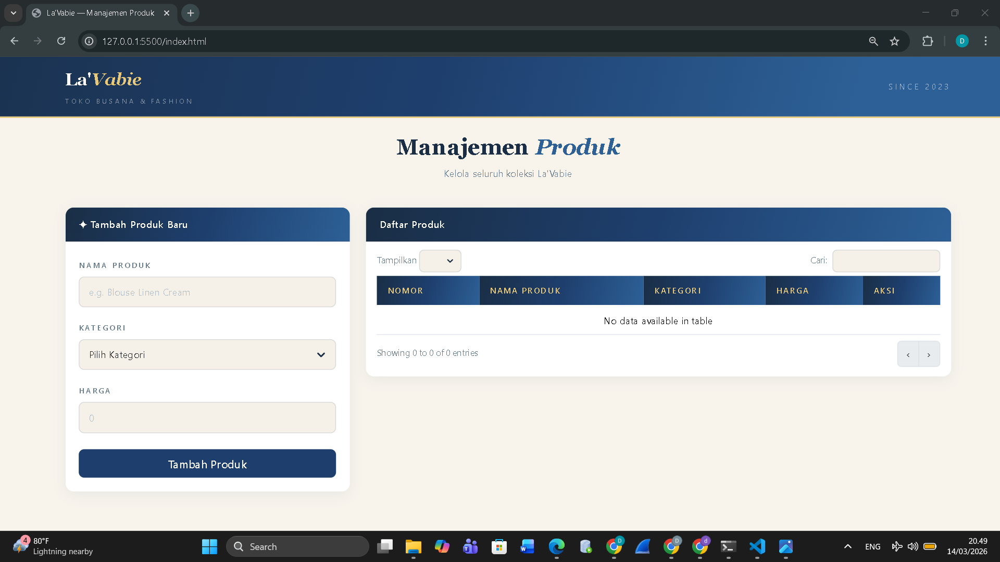
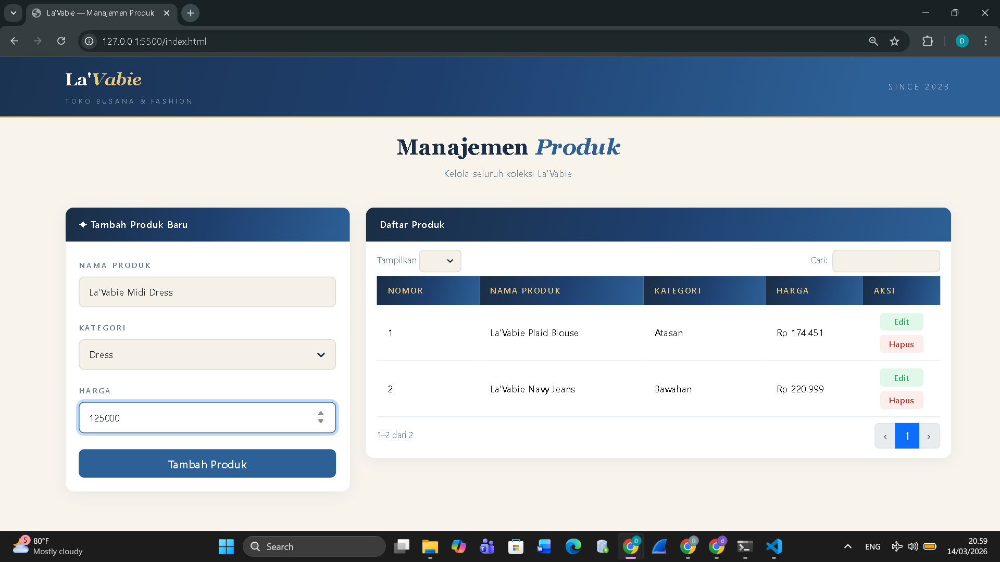
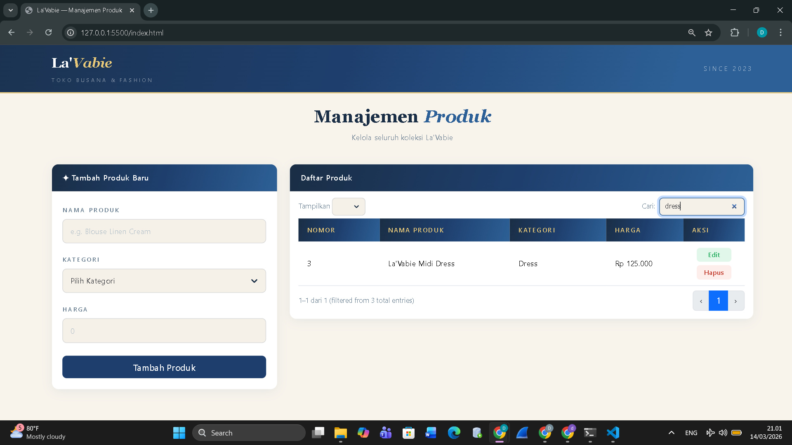
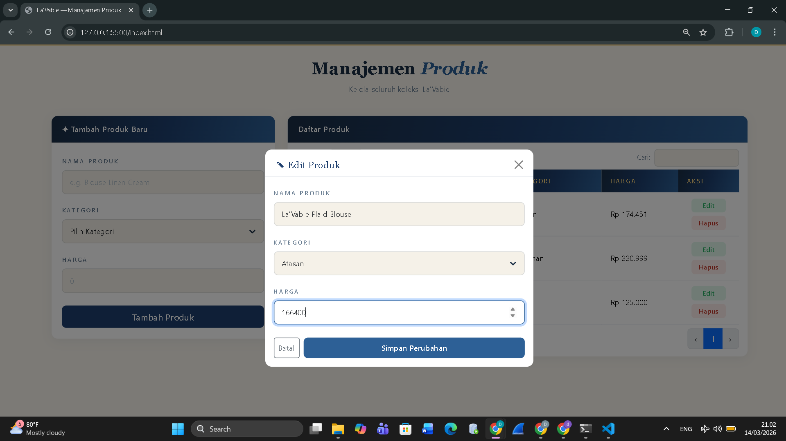
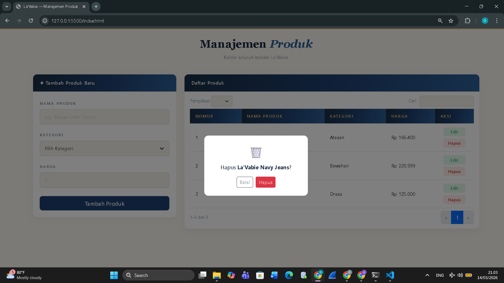

<div align="center">

## LAPORAN PRAKTIKUM <br> APLIKASI BERBASIS PLATFORM
  
<br>

### TUGAS COTS
### MANAJEMEN PRODUK

<br>
<br>


<br>
<br>
<br>

**Disusun oleh:**

**Diva Octaviani**  
**2311102006**  

<br>

**KELAS PS1IF-11-REG01**

**Dosen: Dimas Fanny Hebrasianto Permadi, S.ST., M.Kom**

<br><br>

## PROGRAM STUDI S1 TEKNIK INFORMATIKA <br> FAKULTAS INFORMATIKA <br> UNIVERSITAS TELKOM PURWOKERTO <br> 2026 <br><br>

</div>

---

## 1. Dasar Teori

Bootstrap adalah framework CSS populer yang memudahkan pengembangan antarmuka web responsif dan modern. Framework ini menyediakan berbagai komponen siap pakai seperti navbar, card, form, dan modal yang dapat dikustomisasi sesuai kebutuhan.

jQuery adalah library JavaScript yang membantu mempermudah pengelolaan elemen pada halaman web. Dengan jQuery, kita bisa menangani interaksi seperti klik tombol, animasi, atau perubahan konten dengan kode yang lebih singkat dan mudah.

DataTables adalah plugin jQuery yang menyediakan fitur untuk memudahkan pencarian real-time, pagination, dan pengurutan data pada tabel sehingga  sehingga pengguna bisa mencari atau memilah data dengan mudah tanpa harus memuat ulang halaman. 

CRUD (*Create*, *Read*, *Update*, dan *Delete*) merupakan dasar dalam mengelola data atau informasi. Pada praktikum ini, penyimpanan data dilakukan menggunakan *Object Mapping* dengan JavaScript, yaitu memetakan setiap produk ke dalam object dengan key berupa ID unik. 

---

## 2. Hasil Praktikum

### **a. Source Code**

Pada tugas COTS ini, dikembangkan halaman Manajemen Produk La'Vabie dengan fitur CRUD sederhana. Kode dipisahkan menjadi tiga: `index.html`, `style.css`, dan `app.js`.

### index.html

```html
<!DOCTYPE html>
<html lang="id">

<head>
    <meta charset="UTF-8" />
    <meta name="viewport" content="width=device-width,initial-scale=1.0" />
    <title>La'Vabie — Manajemen Produk</title>

    <!-- External CSS Libraries -->
    <link href="https://cdn.jsdelivr.net/npm/bootstrap@5.3.2/dist/css/bootstrap.min.css" rel="stylesheet" />
    <link href="https://cdn.datatables.net/1.13.6/css/dataTables.bootstrap5.min.css" rel="stylesheet" />

    <!-- Custom CSS -->
    <link href="style.css" rel="stylesheet" />
</head>

<body>

    <!-- NAVBAR -->
    <nav class="navbar">
        <div class="container d-flex justify-content-between align-items-center">
            <div>
                <span class="brand-name">La'<em>Vabie</em></span>
                <div class="brand-sub">TOKO BUSANA & FASHION</div>
            </div>
            <span class="nav-right">SINCE 2023</span>
        </div>
    </nav>

    <!-- PAGE HEADER -->
    <div class="page-header">
        <div class="container">
            <h1 class="page-title">Manajemen <em>Produk</em></h1>
            <p class="page-sub">Kelola seluruh koleksi La'Vabie</p>
        </div>
    </div>

    <!-- MAIN CONTENT -->
    <div class="container pb-5">
        <div class="row g-4">
            <div class="col-lg-4">
                <div class="card">
                    <div class="card-header">✦ Tambah Produk Baru</div>
                    <div class="card-body">
                        <form id="form">
                            <div class="mb-3">
                                <label class="form-label">Nama Produk</label>
                                <input type="text" id="nama" class="form-control" placeholder="e.g. Blouse Linen Cream"
                                    required />
                            </div>
                            <div class="mb-3">
                                <label class="form-label">Kategori</label>
                                <select id="kategori" class="form-select" required>
                                    <option value="">Pilih Kategori</option>
                                    <option>Atasan</option>
                                    <option>Bawahan</option>
                                    <option>Dress</option>
                                    <option>Hijab</option>
                                    <option>Aksesoris</option>
                                </select>
                            </div>
                            <div class="mb-4">
                                <label class="form-label">Harga</label>
                                <input type="number" id="harga" class="form-control" placeholder="0" min="1" required />
                            </div>
                            <button type="submit" class="btn btn-primary">Tambah Produk</button>
                        </form>
                    </div>
                </div>
            </div>
            <div class="col-lg-8">
                <div class="card">
                    <div class="card-header">Daftar Produk</div>
                    <div class="card-body p-0">
                        <table id="tabel" class="table mb-0" style="width:100%">
                            <thead>
                                <tr>
                                    <th>Nomor</th>
                                    <th>Nama Produk</th>
                                    <th>Kategori</th>
                                    <th>Harga</th>
                                    <th>Aksi</th>
                                </tr>
                            </thead>
                            <tbody></tbody>
                        </table>
                    </div>
                </div>
            </div>
        </div>
    </div>

    <!-- Modal Hapus -->
    <div class="modal fade" id="modalHapus" tabindex="-1">
        <div class="modal-dialog modal-dialog-centered modal-sm">
            <div class="modal-content">
                <div class="modal-body text-center py-4">
                    <div style="font-size:2rem;margin-bottom:8px">🗑️</div>
                    <p>Hapus <strong id="namaHapus"></strong>?</p>
                    <div class="d-flex gap-2 justify-content-center mt-3">
                        <button class="btn btn-outline-secondary btn-sm" data-bs-dismiss="modal">Batal</button>
                        <button class="btn btn-danger btn-sm" id="konfirmasiHapus">Hapus</button>
                    </div>
                </div>
            </div>
        </div>
    </div>

    <!-- Modal Edit -->
    <div class="modal fade" id="modalEdit" tabindex="-1">
        <div class="modal-dialog modal-dialog-centered">
            <div class="modal-content">
                <div class="modal-header">
                    <h5 class="modal-title">✎ Edit Produk</h5>
                    <button type="button" class="btn-close" data-bs-dismiss="modal"></button>
                </div>
                <div class="modal-body">
                    <form id="formEdit">
                        <input type="hidden" id="editId">
                        <div class="mb-3">
                            <label class="form-label">Nama Produk</label>
                            <input type="text" id="editNama" class="form-control" required />
                        </div>
                        <div class="mb-3">
                            <label class="form-label">Kategori</label>
                            <select id="editKategori" class="form-select" required>
                                <option value="">Pilih Kategori</option>
                                <option>Atasan</option>
                                <option>Bawahan</option>
                                <option>Dress</option>
                                <option>Hijab</option>
                                <option>Aksesoris</option>
                            </select>
                        </div>
                        <div class="mb-4">
                            <label class="form-label">Harga</label>
                            <input type="number" id="editHarga" class="form-control" min="1" required />
                        </div>
                        <div class="d-flex gap-2 justify-content-end">
                            <button type="button" class="btn btn-outline-secondary btn-sm"
                                data-bs-dismiss="modal">Batal</button>
                            <button type="submit" class="btn btn-primary btn-sm">Simpan Perubahan</button>
                        </div>
                    </form>
                </div>
            </div>
        </div>
    </div>

    <!-- Toast -->
    <div class="toast align-items-center" id="toast" role="alert">
        <div class="d-flex">
            <div class="toast-body" id="toastMsg"></div>
            <button type="button" class="btn-close btn-close-white me-2 m-auto" data-bs-dismiss="toast"></button>
        </div>
    </div>

    <!-- External JS Libraries -->
    <script src="https://code.jquery.com/jquery-3.7.1.min.js"></script>
    <script src="https://cdn.jsdelivr.net/npm/bootstrap@5.3.2/dist/js/bootstrap.bundle.min.js"></script>
    <script src="https://cdn.datatables.net/1.13.6/js/jquery.dataTables.min.js"></script>
    <script src="https://cdn.datatables.net/1.13.6/js/dataTables.bootstrap5.min.js"></script>

    <!-- Custom JS -->
    <script src="app.js"></script>
</body>

</html>
```

Kode HTML berfungsi sebagai kerangka utama halaman web. Bagian penting meliputi:

- CDN Links: Menghubungkan halaman dengan library eksternal seperti Bootstrap (tampilan), jQuery (logika), dan DataTables (tabel interaktif) agar tidak perlu mengunduh file manual.

- Form Input: Bagian dengan id form digunakan untuk memasukkan data produk (Nama, Kategori, Harga).

- Tabel Data: Elemen dengan id tabel adalah tempat dimana data produk akan ditampilkan secara dinamis.

- Modal & Toast: Komponen tambahan untuk konfirmasi penghapusan data (Modal) dan notifikasi sukses (Toast) agar interaksi pengguna lebih jelas.

### style.css

```html
:root {
    --denim-dark: #1a2e45;
    --denim: #1e3f6e;
    --denim-mid: #2d6096;
    --yellow: #e8c97a;
    --cream: #f8f4ec;
    --white: #fff;
    --text: #1a2e45;
    --muted: #6a7e92;
}

* {
    box-sizing: border-box;
    margin: 0;
    padding: 0;
}

body {
    font-family: system-ui, -apple-system, sans-serif;
    background: var(--cream);
    color: var(--text);
}

/* Navbar */
.navbar {
    background: linear-gradient(105deg, var(--denim-dark), var(--denim) 45%, var(--denim-mid) 75%);
    border-bottom: 3px solid var(--yellow);
    padding: 16px 0;
}

.brand-name {
    font-family: Georgia, serif;
    font-size: 1.55rem;
    color: #fff;
    font-weight: 600;
}

.brand-name em {
    color: var(--yellow);
    font-style: italic;
}

.brand-sub {
    font-size: 0.63rem;
    color: rgba(255, 255, 255, .45);
    letter-spacing: 3.5px;
    margin-top: 3px;
}

.nav-right {
    color: rgba(255, 255, 255, .5);
    font-size: 0.7rem;
    letter-spacing: 3px;
}

/* Page Header */
.page-header {
    background: var(--cream);
    padding: 24px 0;
    text-align: center;
}

.page-title {
    font-family: Georgia, serif;
    font-size: 2rem;
    font-weight: 600;
    color: var(--text);
}

.page-title em {
    color: var(--denim-mid);
    font-style: italic;
}

.page-sub {
    color: var(--muted);
    font-size: 0.88rem;
    margin-top: 5px;
}

/* Cards */
.card {
    border: none;
    border-radius: 12px;
    box-shadow: 0 4px 20px rgba(30, 63, 110, .08);
    margin-bottom: 24px;
}

.card-header {
    background: linear-gradient(105deg, var(--denim-dark), var(--denim) 50%, var(--denim-mid));
    color: #fff;
    border-radius: 12px 12px 0 0 !important;
    padding: 14px 20px;
    font-size: 0.88rem;
    font-weight: 600;
    letter-spacing: 0.4px;
}

.card-body {
    padding: 20px;
}

/* Form */
.form-label {
    font-size: 0.68rem;
    font-weight: 600;
    color: var(--muted);
    letter-spacing: 2.5px;
    margin-bottom: 8px;
    text-transform: uppercase;
}

.form-control,
.form-select {
    border: 1.5px solid rgba(30, 63, 110, .14);
    border-radius: 8px;
    padding: 11px 14px;
    font-size: 0.88rem;
    background: #f5f1e8;
}

.form-control:focus,
.form-select:focus {
    outline: none;
    border-color: var(--denim-mid);
    background: var(--white);
}

.form-control::placeholder {
    color: #b0bec8;
}

/* Custom dropdown arrow untuk Kategori */
#kategori,
#editKategori {
    appearance: none;
    -webkit-appearance: none;
    -moz-appearance: none;
    background-image: url("data:image/svg+xml,%3Csvg xmlns='http://www.w3.org/2000/svg' width='24' height='24' viewBox='0 0 24 24' fill='none' stroke='%231a2e45' stroke-width='3' stroke-linecap='round' stroke-linejoin='round'%3E%3Cpolyline points='6 9 12 15 18 9'%3E%3C/polyline%3E%3C/svg%3E");
    background-repeat: no-repeat;
    background-position: right 12px center;
    background-size: 18px 18px;
    padding-right: 42px;
    cursor: pointer;
}

/* Buttons */
.btn-primary {
    background: var(--denim);
    border: none;
    border-radius: 8px;
    padding: 9px 20px;
    font-weight: 600;
    width: 100%;
}

.btn-primary:hover {
    background: var(--denim-mid);
}

/* Table */
.table {
    margin: 0;
}

.table thead th {
    background: linear-gradient(105deg, var(--denim-dark), var(--denim) 50%, var(--denim-mid));
    color: var(--yellow);
    border: none;
    font-size: 0.7rem;
    letter-spacing: 1.8px;
    font-weight: 600;
    padding: 13px 16px;
    text-transform: uppercase;
}

.table tbody td {
    padding: 11px 16px;
    font-size: 0.87rem;
    border-color: rgba(30, 63, 110, .14);
    vertical-align: middle;
}

.table tbody tr:hover {
    background: rgba(232, 201, 122, .07);
}

/* Action Buttons - Edit & Hapus */
.action-buttons {
    display: flex;
    flex-direction: column;
    gap: 6px;
    align-items: center;
    min-width: 70px;
}

.btn-edit {
    padding: 4px 0;
    width: 64px;
    border-radius: 6px;
    font-size: 0.77rem;
    font-weight: 600;
    background: rgba(46, 204, 113, .15);
    color: #27ae60;
    border: none;
    transition: all 0.2s ease;
}

.btn-edit:hover {
    background: #2ecc71;
    color: #fff;
    transform: translateY(-1px);
}

.btn-del {
    padding: 4px 0;
    width: 64px;
    border-radius: 6px;
    font-size: 0.77rem;
    font-weight: 600;
    background: rgba(231, 76, 60, .1);
    color: #c0392b;
    border: none;
    transition: all 0.2s ease;
}

.btn-del:hover {
    background: #e74c3c;
    color: #fff;
    transform: translateY(-1px);
}

/* DataTables */
.dataTables_wrapper {
    padding: 12px 16px;
}

.dataTables_wrapper .dataTables_filter input,
.dataTables_wrapper .dataTables_length select {
    border: 1.5px solid rgba(30, 63, 110, .14);
    border-radius: 7px;
    padding: 5px 10px;
    font-size: 0.83rem;
    background: #f5f1e8;
}

.dataTables_wrapper .dataTables_filter input:focus {
    outline: none;
    border-color: var(--denim-mid);
}

.dataTables_info,
.dataTables_filter label,
.dataTables_length label {
    font-size: 0.81rem;
    color: var(--muted);
}

/* Custom dropdown arrow untuk DataTables length select */
.dataTables_wrapper .dataTables_length select {
    appearance: none;
    -webkit-appearance: none;
    -moz-appearance: none;
    background-image: url("data:image/svg+xml,%3Csvg xmlns='http://www.w3.org/2000/svg' width='24' height='24' viewBox='0 0 24 24' fill='none' stroke='%231a2e45' stroke-width='3' stroke-linecap='round' stroke-linejoin='round'%3E%3Cpolyline points='6 9 12 15 18 9'%3E%3C/polyline%3E%3C/svg%3E");
    background-repeat: no-repeat;
    background-position: right 8px center;
    background-size: 14px 14px;
    padding-right: 30px;
    cursor: pointer;
}

.dataTables_paginate .paginate_button {
    border-radius: 6px !important;
    font-size: 0.81rem !important;
    color: var(--muted) !important;
    border: none !important;
}

.dataTables_paginate .paginate_button.current,
.dataTables_paginate .paginate_button.current:hover {
    background: var(--denim) !important;
    color: #fff !important;
}

.dataTables_paginate .paginate_button:hover {
    background: rgba(30, 58, 95, .1) !important;
    color: var(--denim) !important;
}

/* Modal & Toast */
.modal-content {
    border: none;
    border-radius: 12px;
}

.modal-header {
    border-bottom: 1px solid rgba(30, 63, 110, .1);
    padding: 16px 20px 8px;
}

.modal-title {
    font-family: Georgia, serif;
    font-size: 1.1rem;
    color: var(--denim);
}

.toast {
    position: fixed;
    bottom: 24px;
    right: 24px;
    z-index: 9999;
    background: var(--denim);
    color: #fff;
    border-left: 4px solid var(--yellow);
    border-radius: 8px;
}

.toast .btn-close {
    filter: invert(1);
}
```

Kode CSS bertugas mengatur tampilan agar terlihat menarik dan sesuai branding La'Vabie. Bagian penting meliputi:

- CSS Variables: Mendefinisikan kode warna di awal agar mudah diubah secara menyeluruh jika ingin mengganti tema warna.

- Custom Styling: Mengubah tampilan standar Bootstrap seperti navbar, kartu, dan tombol agar memiliki gradasi warna dan gaya yang unik.

- DataTables Integration: Menyesuaikan warna dan gaya tabel pencarian serta pagination agar menyatu dengan desain halaman, tidak terlihat kaku seperti tampilan bawaan.

### app.js

```html
// Database Simulation
const DB = {
    data: {},
    nextId: 1,
    add(n, k, h) {
        const id = this.nextId++;
        this.data[id] = { id, nama: n, kategori: k, harga: +h };
    },
    del(id) {
        delete this.data[id];
    },
    update(id, n, k, h) {
        if (this.data[id])
            this.data[id] = { id, nama: n, kategori: k, harga: +h };
    },
    all() {
        return Object.values(this.data);
    },
    get(id) {
        return this.data[id];
    },
    cnt() {
        return Object.keys(this.data).length;
    }
};

// Format Rupiah
const rp = n => new Intl.NumberFormat('id-ID', {
    style: 'currency',
    currency: 'IDR',
    minimumFractionDigits: 0
}).format(n);

// Global Variables
let dt, delId, editId, toastEl;

// Toast Notification
const toast = m => {
    $('#toastMsg').text(m);
    toastEl.show();
};

// Render Table
const render = () => {
    dt.clear();
    DB.all().forEach((p, i) => dt.row.add([
        i + 1,
        p.nama,
        p.kategori,
        rp(p.harga),
        `<div class="action-buttons">
            <button class="btn btn-edit" data-id="${p.id}">Edit</button>
            <button class="btn btn-del" data-id="${p.id}">Hapus</button>
        </div>`
    ]));
    dt.draw();
};

// Handle Form Submit - Tambah Produk
$('#form').submit(e => {
    e.preventDefault();
    const n = $('#nama').val().trim(),
        k = $('#kategori').val(),
        h = $('#harga').val();
    if (!n || !k || !h) return;
    DB.add(n, k, h);
    e.target.reset();
    render();
    toast('✓ Produk ditambahkan');
});

// Handle Edit Button Click
$(document).on('click', '.btn-edit', function () {
    editId = +$(this).data('id');
    const p = DB.get(editId);
    $('#editId').val(p.id);
    $('#editNama').val(p.nama);
    $('#editKategori').val(p.kategori);
    $('#editHarga').val(p.harga);
    new bootstrap.Modal($('#modalEdit')).show();
});

// Handle Edit Form Submit
$('#formEdit').submit(e => {
    e.preventDefault();
    const id = +$('#editId').val();
    const n = $('#editNama').val().trim();
    const k = $('#editKategori').val();
    const h = $('#editHarga').val();
    if (!n || !k || !h) return;

    DB.update(id, n, k, h);
    bootstrap.Modal.getInstance($('#modalEdit')).hide();
    render();
    toast('✓ Produk diperbarui');
});

// Handle Delete Button Click
$(document).on('click', '.btn-del', function () {
    delId = +$(this).data('id');
    $('#namaHapus').text(DB.get(delId).nama);
    new bootstrap.Modal($('#modalHapus')).show();
});

// Handle Confirm Delete
$('#konfirmasiHapus').click(() => {
    DB.del(delId);
    bootstrap.Modal.getInstance($('#modalHapus')).hide();
    render();
    toast('✓ Produk dihapus');
});

// Initialize on Document Ready
$(document).ready(() => {
    toastEl = new bootstrap.Toast($('#toast'), {
        autohide: true,
        delay: 2500
    });

    dt = $('#tabel').DataTable({
        ordering: false,
        language: {
            search: 'Cari:',
            lengthMenu: 'Tampilkan _MENU_',
            info: '_START_–_END_ dari _TOTAL_',
            paginate: { next: '›', previous: '‹' }
        },
        pageLength: 5
    });

    render();
});
```

Kode JavaScript adalah otak dari aplikasi yang menangani logika dan interaksi. Bagian penting meliputi:

- Object DB: Menggunakan objek JavaScript sederhana untuk menyimpan data produk sementara di memori browser tanpa perlu database server.

- Fungsi Render: Bertugas mengambil data dari objek DB dan menampilkannya ke dalam tabel setiap kali ada perubahan data.

- Event Handler: Menangani kejadian seperti saat tombol "Tambah Produk" diklik (simpan data) atau tombol "Hapus" diklik (konfirmasi dan hapus data).

- Inisialisasi DataTables: Mengaktifkan fitur pencarian, pagination, dan pengurutan pada tabel HTML agar menjadi interaktif.

### **b. Screenshot Output**

Berikut merupakan tampilan output yang dihasilkan dari source code tersebut.

### 1. Tampilan Halaman Utama



Halaman utama menampilkan navbar La'Vabie, form input produk di sebelah kiri, dan tabel daftar produk di sebelah kanan. Tabel menggunakan DataTables sehingga memiliki fitur search untuk mencari data dan pagination untuk membagi halaman.

### 2. Menambahkan Data Produk


Form input diisi dengan nama produk, kategori, dan harga. Setelah tombol "Tambah Produk" diklik, data langsung muncul di tabel dengan format harga dalam Rupiah.

### 3. Mencari Data Produk


Fitur search DataTables digunakan untuk memfilter data produk secara real-time. Ketika kata kunci diketik di kolom pencarian, tabel otomatis menampilkan hanya data yang sesuai tanpa perlu reload halaman.

### 4. Mengubah Data Produk


Ketika tombol "Edit" pada baris tabel diklik, muncul modal "Edit Produk" yang sudah terisi dengan data produk yang akan diubah. Pengguna dapat memodifikasi nama produk, kategori, atau harga, kemudian klik tombol "Simpan Perubahan" untuk menyimpan hasil edit ke dalam tabel.

### 5. Menghapus Data Produk


Ketika tombol "Hapus" diklik, muncul modal konfirmasi yang menampilkan nama produk yang akan dihapus. Setelah pengguna mengklik tombol "Hapus" pada modal, data produk tersebut langsung terhapus dari tabel.